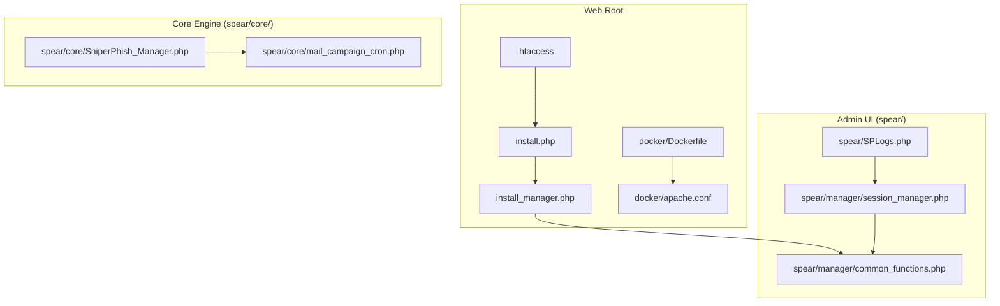
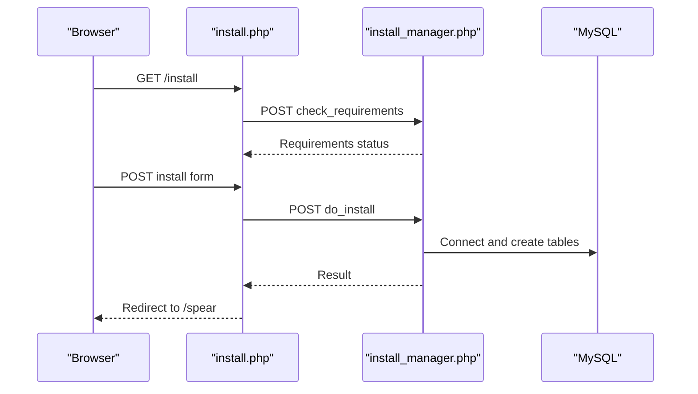
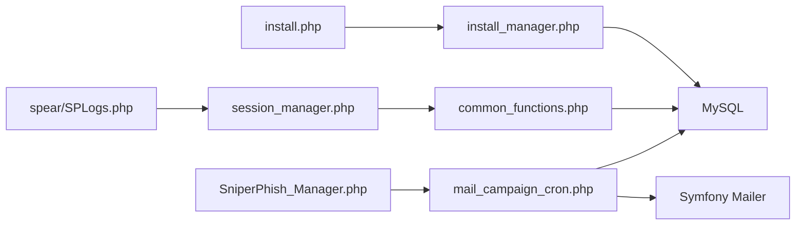

# Troubleshooting and FAQ

<cite>
**Referenced Files in This Document**
- [README.md](file://README.md)
- [install.php](file://install.php)
- [install_manager.php](file://install_manager.php)
- [.htaccess](file://.htaccess)
- [docker/Dockerfile](file://docker/Dockerfile)
- [docker/apache.conf](file://docker/apache.conf)
- [spear/SPLogs.php](file://spear/SPLogs.php)
- [spear/manager/session_manager.php](file://spear/manager/session_manager.php)
- [spear/manager/common_functions.php](file://spear/manager/common_functions.php)
- [spear/core/SniperPhish_Manager.php](file://spear/core/SniperPhish_Manager.php)
- [spear/core/mail_campaign_cron.php](file://spear/core/mail_campaign_cron.php)
</cite>

## Table of Contents
1. [Introduction](#introduction)
2. [Project Structure](#project-structure)
3. [Core Components](#core-components)
4. [Architecture Overview](#architecture-overview)
5. [Detailed Component Analysis](#detailed-component-analysis)
6. [Dependency Analysis](#dependency-analysis)
7. [Performance Considerations](#performance-considerations)
8. [Troubleshooting Guide](#troubleshooting-guide)
9. [Conclusion](#conclusion)
10. [Appendices](#appendices)

## Introduction
This document provides comprehensive troubleshooting and FAQ guidance for SniperPhish. It focuses on installation issues, performance optimization, debugging techniques, and support resources. It also covers common problems such as PHP version compatibility, database connection failures, email delivery issues, and tracking system malfunctions. Step-by-step resolution procedures, diagnostic commands, verification steps, and logging guidance via the built-in SPLogs are included. Guidance on system monitoring, alerting, maintenance, legal considerations, ethical usage, and best practices for phishing simulation deployments is provided, along with escalation procedures and support resources.

## Project Structure
SniperPhish is organized around a web-based admin interface (spear/), a core mail campaign engine (spear/core/), and a logging UI (spear/SPLogs.php). Installation and environment checks are handled by install.php and install_manager.php. The project supports Docker-based deployment with a ready-to-use Apache + PHP 8.1 configuration.

**Diagram sources**
- [install.php:1-451](file://install.php#L1-L451)
- [install_manager.php:1-784](file://install_manager.php#L1-L784)
- [.htaccess:1-5](file://.htaccess#L1-L5)
- [docker/Dockerfile:1-10](file://docker/Dockerfile#L1-L10)
- [docker/apache.conf:1-13](file://docker/apache.conf#L1-L13)
- [spear/SPLogs.php:1-203](file://spear/SPLogs.php#L1-L203)
- [spear/manager/session_manager.php:1-244](file://spear/manager/session_manager.php#L1-L244)
- [spear/manager/common_functions.php:1-595](file://spear/manager/common_functions.php#L1-L595)
- [spear/core/SniperPhish_Manager.php:1-46](file://spear/core/SniperPhish_Manager.php#L1-L46)
- [spear/core/mail_campaign_cron.php:1-364](file://spear/core/mail_campaign_cron.php#L1-L364)

**Section sources**
- [README.md:1-86](file://README.md#L1-L86)
- [install.php:1-451](file://install.php#L1-L451)
- [install_manager.php:1-784](file://install_manager.php#L1-L784)
- [.htaccess:1-5](file://.htaccess#L1-L5)
- [docker/Dockerfile:1-10](file://docker/Dockerfile#L1-L10)
- [docker/apache.conf:1-13](file://docker/apache.conf#L1-L13)
- [spear/SPLogs.php:1-203](file://spear/SPLogs.php#L1-L203)
- [spear/manager/session_manager.php:1-244](file://spear/manager/session_manager.php#L1-L244)
- [spear/manager/common_functions.php:1-595](file://spear/manager/common_functions.php#L1-L595)
- [spear/core/SniperPhish_Manager.php:1-46](file://spear/core/SniperPhish_Manager.php#L1-L46)
- [spear/core/mail_campaign_cron.php:1-364](file://spear/core/mail_campaign_cron.php#L1-L364)

## Core Components
- Installation and environment checks: install.php and install_manager.php validate PHP version, required extensions, and filesystem permissions, and create database configuration and tables.
- Logging and audit trail: SPLogs.php displays entries from the tb_log table; common_functions.php provides the logIt() function used by the system.
- Session and authentication: session_manager.php manages sessions, validates login, and updates login/logout history.
- Mail campaign engine: mail_campaign_cron.php constructs and sends emails, applies anti-flood controls, and records delivery status.
- Background scheduler: SniperPhish_Manager.php runs continuously to detect scheduled campaigns and spawn per-campaign cron workers.

Key responsibilities and integration points are covered in the sections below.

**Section sources**
- [install_manager.php:22-87](file://install_manager.php#L22-L87)
- [spear/SPLogs.php:84-96](file://spear/SPLogs.php#L84-L96)
- [spear/manager/common_functions.php:576-586](file://spear/manager/common_functions.php#L576-L586)
- [spear/manager/session_manager.php:17-73](file://spear/manager/session_manager.php#L17-L73)
- [spear/core/mail_campaign_cron.php:99-294](file://spear/core/mail_campaign_cron.php#L99-L294)
- [spear/core/SniperPhish_Manager.php:31-45](file://spear/core/SniperPhish_Manager.php#L31-L45)

## Architecture Overview
The system comprises:
- Web installer validating environment and writing db.php
- Admin UI with session management and logging
- Mail campaign scheduler and per-campaign workers
- Database storing configuration, campaign data, live events, and logs

**Diagram sources**
- [install.php:144-229](file://install.php#L144-L229)
- [install_manager.php:15-162](file://install_manager.php#L15-L162)

**Section sources**
- [install.php:144-229](file://install.php#L144-L229)
- [install_manager.php:15-162](file://install_manager.php#L15-L162)

## Detailed Component Analysis

### Installation and Environment Checks
Common issues:
- PHP version too low
- Missing required PHP extensions (mysqli, imap, gd)
- Directory permissions preventing db.php creation or upload writes
- Web server URL rewriting not supported (.htaccess ignored)

Resolution steps:
- Verify PHP version meets the minimum requirement.
- Enable mysqli, imap, and gd extensions.
- Ensure write permissions for spear/config, spear/uploads, and sniperhost directories.
- Confirm .htaccess is loaded and AllowOverride allows RewriteEngine.

Verification:
- Use the installer’s “Requirements check” page to validate environment.
- Confirm db.php is created after successful install.
- Test URL rewriting by accessing /install and /spear.

**Section sources**
- [install_manager.php:22-87](file://install_manager.php#L22-L87)
- [install_manager.php:110-162](file://install_manager.php#L110-L162)
- [install.php:150-175](file://install.php#L150-L175)
- [.htaccess:1-5](file://.htaccess#L1-L5)

### Logging System (SPLogs.php and tb_log)
The logging mechanism:
- logIt() inserts entries into tb_log with username, log message, IP, and timestamp.
- SPLogs.php provides a UI to view, export, and clear logs.

Operational guidance:
- Use SPLogs to review recent activity and errors.
- Export logs for incident analysis.
- Clear logs periodically to control storage growth.

**Section sources**
- [spear/manager/common_functions.php:576-586](file://spear/manager/common_functions.php#L576-L586)
- [spear/SPLogs.php:84-96](file://spear/SPLogs.php#L84-L96)

### Session Management and Authentication
Behavior:
- Validates login credentials against hashed passwords.
- Updates last login/logout timestamps.
- Manages session cookies and prevents concurrent sessions.

Troubleshooting:
- If redirected to installer before login, verify db.php exists.
- If session expires unexpectedly, check cookie settings and server time zone.

**Section sources**
- [spear/manager/session_manager.php:17-73](file://spear/manager/session_manager.php#L17-L73)
- [spear/manager/session_manager.php:215-234](file://spear/manager/session_manager.php#L215-L234)

### Mail Campaign Engine (mail_campaign_cron.php)
Key processing:
- Loads campaign, user group, template, sender, and configuration.
- Generates unique RID per recipient.
- Applies keyword filtering and QR/barcode embedding.
- Sends via DSN-based transport with optional signing/encryption.
- Records delivery status and errors.

Anti-flood and retry:
- Implements per-batch pause and per-message delays.
- Retries on transient transport exceptions.

Monitoring:
- Live status stored in tb_data_mailcamp_live.
- Logs via logIt() for auditability.

**Section sources**
- [spear/core/mail_campaign_cron.php:17-83](file://spear/core/mail_campaign_cron.php#L17-L83)
- [spear/core/mail_campaign_cron.php:99-294](file://spear/core/mail_campaign_cron.php#L99-L294)
- [spear/core/mail_campaign_cron.php:307-323](file://spear/core/mail_campaign_cron.php#L307-L323)
- [spear/manager/common_functions.php:114-143](file://spear/manager/common_functions.php#L114-L143)

### Background Scheduler (SniperPhish_Manager.php)
Behavior:
- Ensures single-instance execution by tracking PID in tb_main_cron.
- Scans for scheduled campaigns and spawns per-campaign workers.

Troubleshooting:
- If “Process already running” appears, verify no duplicate cron processes.
- Check PID updates and campaign locks.

**Section sources**
- [spear/core/SniperPhish_Manager.php:10-28](file://spear/core/SniperPhish_Manager.php#L10-L28)
- [spear/core/SniperPhish_Manager.php:31-45](file://spear/core/SniperPhish_Manager.php#L31-L45)

## Dependency Analysis
High-level dependencies:
- Web installer depends on install_manager.php and database connectivity.
- Admin UI depends on session_manager.php and common_functions.php.
- Mail engine depends on Symfony Mailer, configuration, and database.
- Scheduler depends on mail_campaign_cron.php and OS process detection.

**Diagram sources**
- [install.php:144-229](file://install.php#L144-L229)
- [install_manager.php:110-162](file://install_manager.php#L110-L162)
- [spear/SPLogs.php:1-203](file://spear/SPLogs.php#L1-L203)
- [spear/manager/session_manager.php:1-244](file://spear/manager/session_manager.php#L1-L244)
- [spear/manager/common_functions.php:1-595](file://spear/manager/common_functions.php#L1-L595)
- [spear/core/SniperPhish_Manager.php:1-46](file://spear/core/SniperPhish_Manager.php#L1-L46)
- [spear/core/mail_campaign_cron.php:1-364](file://spear/core/mail_campaign_cron.php#L1-L364)

**Section sources**
- [install_manager.php:110-162](file://install_manager.php#L110-L162)
- [spear/manager/common_functions.php:114-143](file://spear/manager/common_functions.php#L114-L143)
- [spear/core/SniperPhish_Manager.php:1-46](file://spear/core/SniperPhish_Manager.php#L1-L46)
- [spear/core/mail_campaign_cron.php:1-364](file://spear/core/mail_campaign_cron.php#L1-L364)

## Performance Considerations
- Database tuning
  - Use appropriate MySQL/MariaDB settings for concurrent connections and query cache.
  - Monitor slow queries and add indexes on frequently filtered columns (e.g., campaign_id, rid).
- Caching strategies
  - Cache static assets via web server configuration.
  - Consider opcode caching (OPcache) for PHP.
- Resource allocation
  - Allocate sufficient CPU/memory for the web server and PHP processes.
  - Limit simultaneous mail sends using anti-flood settings in campaign configuration.
- Scheduler efficiency
  - Keep the background scheduler running and avoid overlapping instances.
  - Tune sleep intervals and batch sizes based on workload.

[No sources needed since this section provides general guidance]

## Troubleshooting Guide

### Installation Issues
Symptoms:
- Installer reports missing PHP extensions or insufficient PHP version.
- Directory permission errors during install.
- .htaccess-related redirects or 404s on /spear.

Resolutions:
- Ensure PHP 8.1+ with mysqli, imap, and gd enabled.
- Grant write permissions to spear/config, spear/uploads, and sniperhost directories.
- Confirm .htaccess is loaded by the server and RewriteEngine is On.

Verification:
- Re-run installer’s “Requirements check.”
- Confirm db.php exists post-install.
- Access /spear and /install without rewrite errors.

**Section sources**
- [install_manager.php:22-87](file://install_manager.php#L22-L87)
- [install_manager.php:110-162](file://install_manager.php#L110-L162)
- [install.php:150-184](file://install.php#L150-L184)
- [.htaccess:1-5](file://.htaccess#L1-L5)

### PHP Version Compatibility
Symptoms:
- Installer fails with “PHP version >= 8.1 is required.”
- Composer or runtime errors indicate unsupported PHP versions.

Resolutions:
- Upgrade to PHP 8.1 or later.
- Use the provided Dockerfile for a ready-to-use environment.

**Section sources**
- [install_manager.php:28-33](file://install_manager.php#L28-L33)
- [docker/Dockerfile:1-10](file://docker/Dockerfile#L1-L10)

### Database Connection Failures
Symptoms:
- “Connection failed” during install.
- Runtime database errors in UI or logs.

Resolutions:
- Verify host, username, password, and database name.
- Ensure MySQL service is reachable and user has privileges.
- Confirm mysqli extension is enabled.

Verification:
- Test connection externally with the same credentials.
- Check db.php contents and connectivity from PHP.

**Section sources**
- [install_manager.php:120-124](file://install_manager.php#L120-L124)
- [spear/manager/session_manager.php:7-11](file://spear/manager/session_manager.php#L7-L11)

### Email Delivery Issues
Symptoms:
- Emails fail to send or bounce.
- Exceptions reported in campaign logs.
- IMAP replies not detected.

Resolutions:
- Validate sender configuration (DSN type, SMTP host, credentials).
- Enable peer verification appropriately for your provider.
- Review anti-flood limits and delays.
- For replies, ensure mailbox settings are correct and IMAP is enabled.

Verification:
- Use the test delivery modal in the UI to validate SMTP settings.
- Check tb_data_mailcamp_live for send_error details.
- Confirm IMAP search criteria and mailbox connectivity.

**Section sources**
- [spear/core/mail_campaign_cron.php:164-178](file://spear/core/mail_campaign_cron.php#L164-L178)
- [spear/core/mail_campaign_cron.php:266-277](file://spear/core/mail_campaign_cron.php#L266-L277)
- [spear/manager/common_functions.php:114-143](file://spear/manager/common_functions.php#L114-L143)
- [spear/manager/common_functions.php:399-444](file://spear/manager/common_functions.php#L399-L444)

### Tracking System Malfunctions
Symptoms:
- No visits or form submissions recorded.
- Missing RID parameter in tracked URLs.

Resolutions:
- Ensure web trackers are inserted into pages and include the RID parameter.
- Verify tracking endpoints are accessible and not blocked by firewalls.
- Confirm tb_data_webpage_visit and tb_data_webform_submit tables receive data.

Verification:
- Open tracked pages with ?rid=... appended.
- Check tb_data_webpage_visit and tb_data_webform_submit for entries.
- Use SPLogs to correlate tracking events.

**Section sources**
- [README.md:63-67](file://README.md#L63-L67)
- [spear/manager/common_functions.php:257-278](file://spear/manager/common_functions.php#L257-L278)

### Logging and Debugging
- Use SPLogs to inspect recent entries and errors.
- Export logs for deeper analysis.
- Leverage logIt() for custom audit trails.

Verification:
- Confirm entries appear after login and major operations.
- Filter by username, IP, or date range.

**Section sources**
- [spear/SPLogs.php:84-96](file://spear/SPLogs.php#L84-L96)
- [spear/manager/common_functions.php:576-586](file://spear/manager/common_functions.php#L576-L586)

### System Monitoring, Alerting, and Maintenance
- Monitor tb_log volume and archive/export regularly.
- Set up alerts for repeated send errors or scheduler downtime.
- Maintain backups of the database and spear/config.
- Rotate logs and clean spear/uploads periodically.

[No sources needed since this section provides general guidance]

### Legal Considerations, Ethical Usage, and Best Practices
- Obtain proper authorization from the target organization before conducting simulations.
- Use realistic but non-malicious content; avoid causing distress.
- Comply with applicable laws and organizational policies.
- Document and report incidents responsibly.

[No sources needed since this section provides general guidance]

### Deployment Issues (Web Server, Permissions, Security)
- Web server configuration
  - Ensure .htaccess is processed and RewriteEngine is On.
  - Use docker/apache.conf for Apache AllowOverride All.
- File permissions
  - Write access to spear/config, spear/uploads, and sniperhost directories.
- Security hardening
  - Restrict access to sensitive directories.
  - Use HTTPS and strong credentials.
  - Regularly update PHP, web server, and dependencies.

**Section sources**
- [.htaccess:1-5](file://.htaccess#L1-L5)
- [docker/apache.conf:4-7](file://docker/apache.conf#L4-L7)
- [install_manager.php:89-108](file://install_manager.php#L89-L108)

### Escalation Procedures and Support Resources
- For persistent issues:
  - Collect logs via SPLogs and export.
  - Document environment details (PHP version, extensions, OS).
  - Provide reproduction steps and screenshots.
- Official resources:
  - Documentation and demo links are available in the project README.
  - Join the community channels for support.

**Section sources**
- [README.md:70-81](file://README.md#L70-L81)

## Conclusion
This guide consolidates practical troubleshooting steps, performance tips, and operational guidance for SniperPhish. By validating the environment, leveraging the logging system, and following best practices for deployment and ethics, most issues can be resolved quickly. For complex scenarios, escalate with detailed diagnostics and official support channels.

[No sources needed since this section summarizes without analyzing specific files]

## Appendices

### Diagnostic Commands and Verification Steps
- Environment checks
  - Confirm PHP version and extensions.
  - Validate .htaccess rewrite behavior.
- Database checks
  - Verify connectivity and table existence.
- Mail checks
  - Test SMTP settings via UI modal.
  - Inspect tb_data_mailcamp_live for errors.
- Logging checks
  - View and export logs via SPLogs.

[No sources needed since this section provides general guidance]