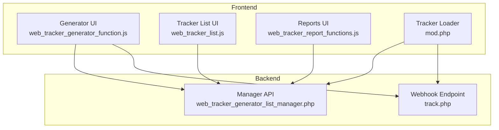
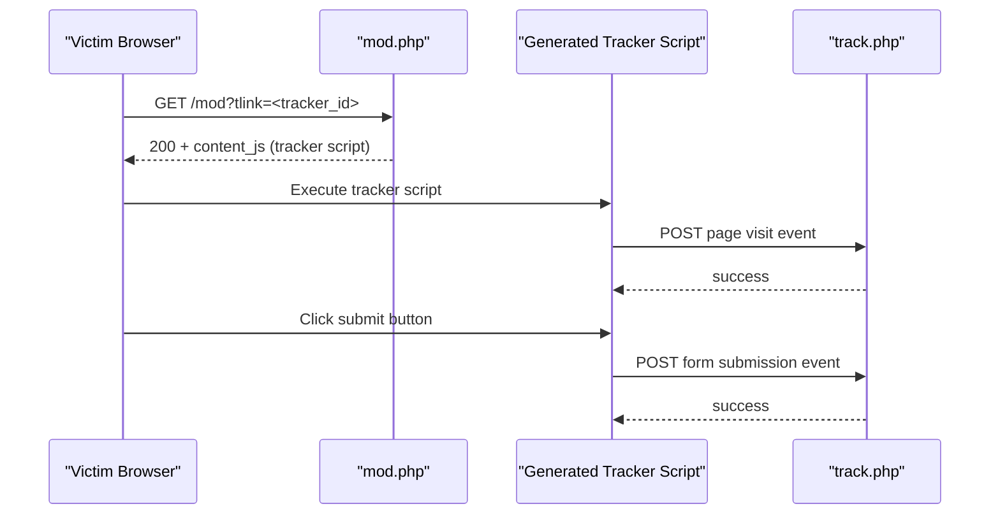
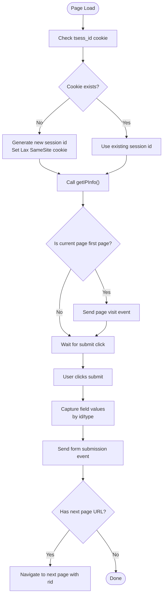
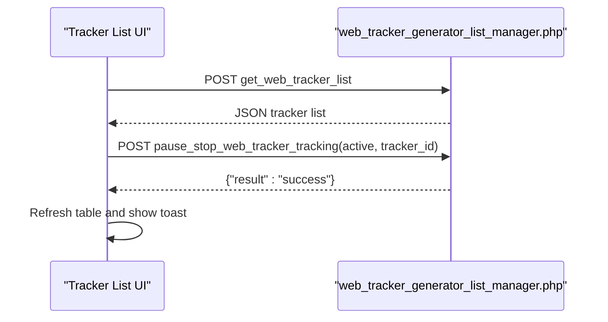
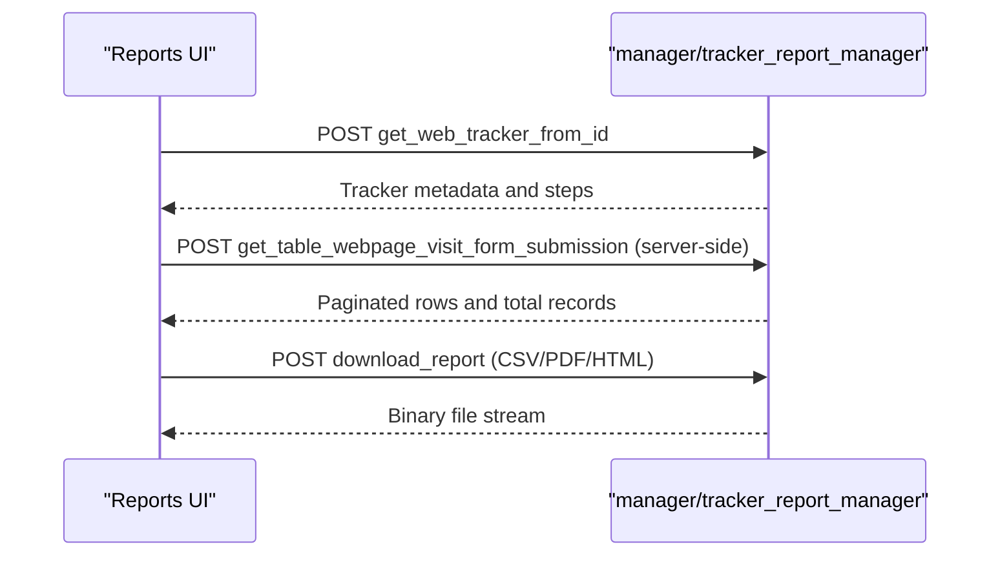
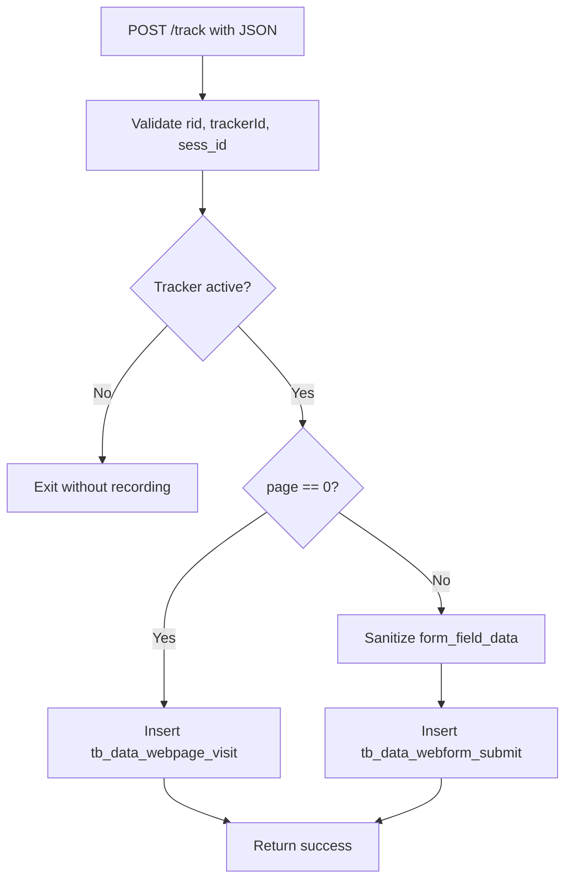
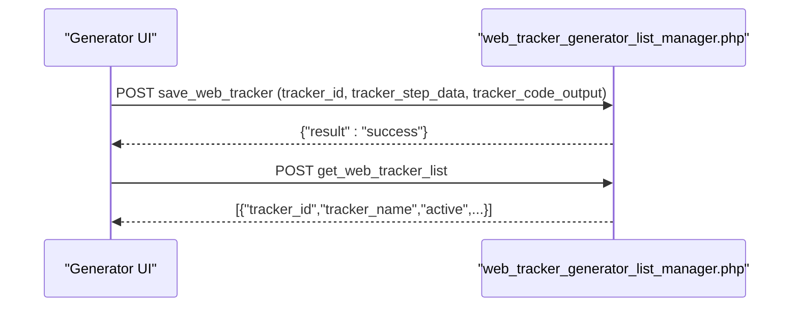
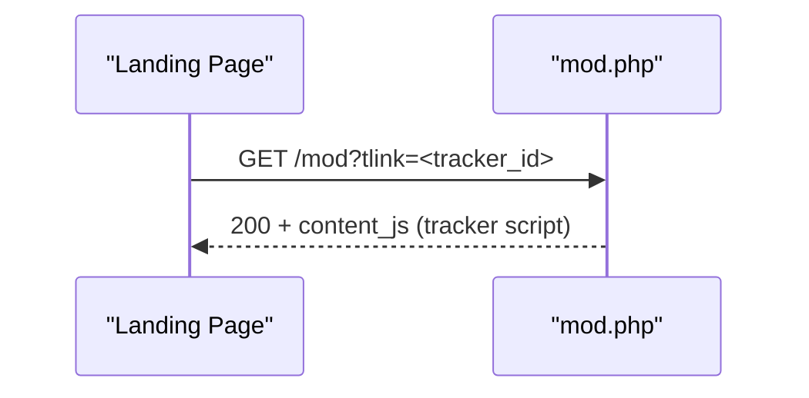
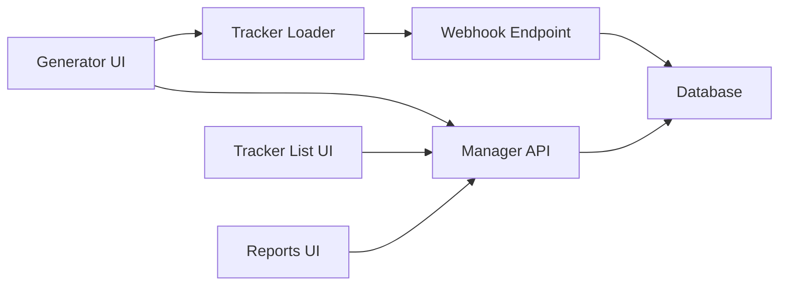

# JavaScript Tracking Engine

<cite>
**Referenced Files in This Document**
- [web_tracker_generator_function.js](file://spear/js/web_tracker_generator_function.js)
- [web_tracker_list.js](file://spear/js/web_tracker_list.js)
- [web_tracker_report_functions.js](file://spear/js/web_tracker_report_functions.js)
- [track.php](file://track.php)
- [web_tracker_generator_list_manager.php](file://spear/manager/web_tracker_generator_list_manager.php)
- [mod.php](file://mod.php)
- [index.php](file://spear/index.php)
</cite>

## Table of Contents
1. [Introduction](#introduction)
2. [Project Structure](#project-structure)
3. [Core Components](#core-components)
4. [Architecture Overview](#architecture-overview)
5. [Detailed Component Analysis](#detailed-component-analysis)
6. [Dependency Analysis](#dependency-analysis)
7. [Performance Considerations](#performance-considerations)
8. [Troubleshooting Guide](#troubleshooting-guide)
9. [Conclusion](#conclusion)
10. [Appendices](#appendices)

## Introduction
This document explains the JavaScript tracking engine responsible for runtime tracking operations. It covers how the generator builds campaign trackers, how the runtime tracker captures page visits and form submissions, how the tracker list manages multiple campaigns, and how the frontend JavaScript integrates with the backend webhook endpoint. It also documents DOM manipulation techniques, data serialization for webhook transmission, error handling, browser compatibility, performance optimization, memory management, and the relationship between frontend and backend.

## Project Structure
The tracking engine spans three primary areas:
- Frontend generator and runtime tracker: spear/js/web_tracker_generator_function.js and generated tracker scripts
- Tracker list management: spear/js/web_tracker_list.js and related backend manager
- Backend webhook and delivery: track.php and mod.php for serving tracker code

**Diagram sources**
- [web_tracker_generator_function.js](file://spear/js/web_tracker_generator_function.js)
- [web_tracker_list.js](file://spear/js/web_tracker_list.js)
- [web_tracker_report_functions.js](file://spear/js/web_tracker_report_functions.js)
- [web_tracker_generator_list_manager.php](file://spear/manager/web_tracker_generator_list_manager.php)
- [mod.php](file://mod.php)
- [track.php](file://track.php)

**Section sources**
- [web_tracker_generator_function.js](file://spear/js/web_tracker_generator_function.js)
- [web_tracker_list.js](file://spear/js/web_tracker_list.js)
- [web_tracker_report_functions.js](file://spear/js/web_tracker_report_functions.js)
- [web_tracker_generator_list_manager.php](file://spear/manager/web_tracker_generator_list_manager.php)
- [mod.php](file://mod.php)
- [track.php](file://track.php)

## Core Components
- Dynamic tracker generation and insertion: The generator constructs tracker code per campaign page, injects a script tag pointing to the tracker loader, and generates static HTML pages with placeholders for form fields. See [generateTrackerCode](file://spear/js/web_tracker_generator_function.js), [generateFormFields](file://spear/js/web_tracker_generator_function.js), and [downloadCodeAsZip](file://spear/js/web_tracker_generator_function.js).
- Runtime tracker: The injected script initializes session cookies, detects IP and device info, sends a page visit event, and registers click handlers to capture form submissions. See [onReady](file://spear/js/web_tracker_generator_function.js) and [do_track_req](file://spear/js/web_tracker_generator_function.js).
- Tracker list management: The list UI fetches, activates/deactivates, copies, deletes, and exports trackers. See [loadTableWebTrackerList](file://spear/js/web_tracker_list.js) and [webTrackerActDeactAction](file://spear/js/web_tracker_list.js).
- Reports: The reports UI selects a tracker, builds column sets, and streams paginated results via server-side processing. See [loadTableWebTrackerResult](file://spear/js/web_tracker_report_functions.js).
- Backend webhook: The endpoint validates requests, checks tracker activity, and persists page visits and form submissions. See [track.php](file://track.php).
- Manager API: Persists tracker definitions, serves tracker lists, and handles lifecycle actions. See [web_tracker_generator_list_manager.php](file://spear/manager/web_tracker_generator_list_manager.php).
- Tracker loader: Serves the tracker script content to the client. See [mod.php](file://mod.php).

**Section sources**
- [web_tracker_generator_function.js](file://spear/js/web_tracker_generator_function.js)
- [web_tracker_list.js](file://spear/js/web_tracker_list.js)
- [web_tracker_report_functions.js](file://spear/js/web_tracker_report_functions.js)
- [track.php](file://track.php)
- [web_tracker_generator_list_manager.php](file://spear/manager/web_tracker_generator_list_manager.php)
- [mod.php](file://mod.php)

## Architecture Overview
The runtime tracking pipeline:
- Campaign definition is built in the generator UI and saved to the backend.
- The generator produces a tracker loader link (e.g., /mod?tlink=<tracker_id>) and static landing pages.
- When a victim loads a landing page, the tracker loader serves the tracker script.
- The tracker script runs on the page, sending a page visit event to the webhook endpoint.
- On form submit, the tracker captures field values and sends a submission event to the webhook endpoint.
- The backend stores events and exposes them via reports.

**Diagram sources**
- [mod.php](file://mod.php)
- [web_tracker_generator_function.js](file://spear/js/web_tracker_generator_function.js)
- [track.php](file://track.php)

## Detailed Component Analysis

### Generator and Runtime Tracker (web_tracker_generator_function.js)
- Dynamic tracker insertion:
  - Builds a script tag that loads the tracker by ID from the tracker loader. See [generateTrackerCode](file://spear/js/web_tracker_generator_function.js).
  - Generates static HTML pages with placeholders for each configured form field. See [generateFormFields](file://spear/js/web_tracker_generator_function.js).
  - Supports downloading pages individually or as a zip archive. See [downloadCode](file://spear/js/web_tracker_generator_function.js) and [downloadCodeAsZip](file://spear/js/web_tracker_generator_function.js).
- Form field extraction algorithms:
  - Text fields, textarea, select, checkbox, radio, and submit button are supported. See [processHTMLFieldFetch](file://spear/js/web_tracker_generator_function.js).
  - Extraction logic maps DOM values to structured data for serialization. See [onReady](file://spear/js/web_tracker_generator_function.js).
- Data collection mechanisms:
  - Session cookie creation and reuse. See [generateTrackerCode](file://spear/js/web_tracker_generator_function.js).
  - IP info retrieval and fallback behavior. See [getIPInfo](file://spear/js/web_tracker_generator_function.js).
  - Screen resolution and device info included in payloads. See [generateTrackerCode](file://spear/js/web_tracker_generator_function.js).
- Webhook transmission:
  - Page visit payload sent synchronously; submission payload sent synchronously. See [do_track_req_visit](file://spear/js/web_tracker_generator_function.js) and [do_track_req](file://spear/js/web_tracker_generator_function.js).
  - Payload includes trackerId, sessionId, screen_res, rid, ip_info, and form_field_data. See [do_track_req](file://spear/js/web_tracker_generator_function.js).
- DOM manipulation techniques:
  - jQuery-based dynamic UI updates for adding/removing pages and fields. See [event handlers](file://spear/js/web_tracker_generator_function.js).
  - Select2 initialization and tooltips. See [updateFieldChanges](file://spear/js/web_tracker_generator_function.js).
  - ClipboardJS integration for copying code. See [copyCode](file://spear/js/web_tracker_generator_function.js).
- Error handling:
  - Validation of webhook endpoint connectivity. See [webhookValidate](file://spear/js/web_tracker_generator_function.js).
  - Graceful fallback when IP lookup fails. See [getIPInfo](file://spear/js/web_tracker_generator_function.js).
- Browser compatibility:
  - Polyfills for forEach and trim for older browsers. See [generateTrackerCode](file://spear/js/web_tracker_generator_function.js).
  - DOM ready detection supporting IE. See [domIsReady](file://spear/js/web_tracker_generator_function.js).

**Diagram sources**
- [web_tracker_generator_function.js](file://spear/js/web_tracker_generator_function.js)

**Section sources**
- [web_tracker_generator_function.js](file://spear/js/web_tracker_generator_function.js)

### Tracker List Management (web_tracker_list.js)
- Loads tracker list via AJAX and renders DataTable with actions (start/resume, pause/stop, edit, delete, delete data, copy, copy link). See [loadTableWebTrackerList](file://spear/js/web_tracker_list.js).
- Activates/deactivates trackers and reflects status changes. See [webTrackerActDeactAction](file://spear/js/web_tracker_list.js).
- Deletion prompts and confirmation flows. See [promptWebTrackerDeletion](file://spear/js/web_tracker_list.js) and [webTrackerDeletionAction](file://spear/js/web_tracker_list.js).
- Copying and renaming trackers. See [webTrackerCopyAction](file://spear/js/web_tracker_list.js).
- Copies tracker embed link to clipboard. See [trackerLinkCopy](file://spear/js/web_tracker_list.js).

**Diagram sources**
- [web_tracker_list.js](file://spear/js/web_tracker_list.js)
- [web_tracker_generator_list_manager.php](file://spear/manager/web_tracker_generator_list_manager.php)

**Section sources**
- [web_tracker_list.js](file://spear/js/web_tracker_list.js)
- [web_tracker_generator_list_manager.php](file://spear/manager/web_tracker_generator_list_manager.php)

### Reports UI (web_tracker_report_functions.js)
- Loads available trackers for selection and displays tracker metadata. See [webTrackerSelected](file://spear/js/web_tracker_report_functions.js).
- Builds selectable columns including form fields per page. See [report_cols_html construction](file://spear/js/web_tracker_report_functions.js).
- Streams paginated results via server-side processing. See [loadTableWebTrackerResult](file://spear/js/web_tracker_report_functions.js).
- Exports reports to CSV/PDF/HTML. See [exportReportAction](file://spear/js/web_tracker_report_functions.js).

**Diagram sources**
- [web_tracker_report_functions.js](file://spear/js/web_tracker_report_functions.js)

**Section sources**
- [web_tracker_report_functions.js](file://spear/js/web_tracker_report_functions.js)

### Backend Webhook (track.php)
- Validates incoming JSON payload and extracts identifiers (rid, sess_id, trackerId). See [track.php](file://track.php).
- Checks tracker active state before recording. See [track.php](file://track.php).
- Records page visits and form submissions with device and IP info. See [track.php](file://track.php).
- Returns success on successful insertions. See [track.php](file://track.php).

**Diagram sources**
- [track.php](file://track.php)

**Section sources**
- [track.php](file://track.php)

### Manager API (web_tracker_generator_list_manager.php)
- Saves or updates tracker definitions with serialized steps and generated code. See [saveWebTracker](file://spear/manager/web_tracker_generator_list_manager.php).
- Lists trackers with formatted timestamps and active status. See [getWebTrackerList](file://spear/manager/web_tracker_generator_list_manager.php).
- Retrieves tracker by ID for editing. See [getWebTrackerFromId](file://spear/manager/web_tracker_generator_list_manager.php).
- Activates/deactivates trackers and records start/stop times. See [pauseStopWebTrackerTracking](file://spear/manager/web_tracker_generator_list_manager.php).
- Deletes trackers and associated data. See [deleteWebTracker](file://spear/manager/web_tracker_generator_list_manager.php) and [deleteWebTrackerData](file://spear/manager/web_tracker_generator_list_manager.php).
- Imports HTML content for automatic field discovery. See [getHTMLContent](file://spear/manager/web_tracker_generator_list_manager.php).

**Diagram sources**
- [web_tracker_generator_list_manager.php](file://spear/manager/web_tracker_generator_list_manager.php)

**Section sources**
- [web_tracker_generator_list_manager.php](file://spear/manager/web_tracker_generator_list_manager.php)

### Tracker Loader (mod.php)
- Serves the tracker script content for a given tracker ID. See [getTrackerCode](file://mod.php).
- Sets appropriate content-type for JavaScript. See [getTrackerCode](file://mod.php).

**Diagram sources**
- [mod.php](file://mod.php)

**Section sources**
- [mod.php](file://mod.php)

## Dependency Analysis
- Generator depends on:
  - Manager API for saving and retrieving tracker definitions. See [saveWebTracker](file://spear/manager/web_tracker_generator_list_manager.php) and [getWebTrackerFromId](file://spear/manager/web_tracker_generator_list_manager.php).
  - Tracker loader to embed the tracker script. See [generateTrackerCode](file://spear/js/web_tracker_generator_function.js) and [mod.php](file://mod.php).
- Runtime tracker depends on:
  - Tracker loader for script content. See [mod.php](file://mod.php).
  - Webhook endpoint for event persistence. See [track.php](file://track.php).
- Tracker list and reports depend on:
  - Manager API for tracker metadata and report queries. See [web_tracker_list.js](file://spear/js/web_tracker_list.js) and [web_tracker_report_functions.js](file://spear/js/web_tracker_report_functions.js).

**Diagram sources**
- [web_tracker_generator_function.js](file://spear/js/web_tracker_generator_function.js)
- [web_tracker_list.js](file://spear/js/web_tracker_list.js)
- [web_tracker_report_functions.js](file://spear/js/web_tracker_report_functions.js)
- [web_tracker_generator_list_manager.php](file://spear/manager/web_tracker_generator_list_manager.php)
- [mod.php](file://mod.php)
- [track.php](file://track.php)

**Section sources**
- [web_tracker_generator_function.js](file://spear/js/web_tracker_generator_function.js)
- [web_tracker_list.js](file://spear/js/web_tracker_list.js)
- [web_tracker_report_functions.js](file://spear/js/web_tracker_report_functions.js)
- [web_tracker_generator_list_manager.php](file://spear/manager/web_tracker_generator_list_manager.php)
- [mod.php](file://mod.php)
- [track.php](file://track.php)

## Performance Considerations
- Minimize synchronous XHR:
  - Submission requests are synchronous, which blocks the UI thread. Prefer asynchronous requests with deferred navigation after success. See [do_track_req](file://spear/js/web_tracker_generator_function.js).
- Reduce DOM queries:
  - Cache jQuery selections for repeated operations (e.g., form fields area). See [onReady](file://spear/js/web_tracker_generator_function.js).
- Efficient event registration:
  - Register click handlers once during DOM ready. See [onReady](file://spear/js/web_tracker_generator_function.js).
- Optimize report rendering:
  - Use server-side pagination and filtering in reports. See [loadTableWebTrackerResult](file://spear/js/web_tracker_report_functions.js).
- Memory management:
  - Avoid accumulating large payloads in memory; serialize only required fields. See [do_track_req](file://spear/js/web_tracker_generator_function.js).
  - Clear temporary variables after use to prevent leaks. See [generateTrackerCode](file://spear/js/web_tracker_generator_function.js).

[No sources needed since this section provides general guidance]

## Troubleshooting Guide
- Webhook validation fails:
  - Verify the webhook URL responds to a test payload. See [webhookValidate](file://spear/js/web_tracker_generator_function.js).
- Tracker not recording events:
  - Confirm tracker is active and not paused. See [track.php](file://track.php) and [webTrackerActDeactAction](file://spear/js/web_tracker_list.js).
- Session cookie issues:
  - Ensure SameSite and domain policies allow cookie setting. See [generateTrackerCode](file://spear/js/web_tracker_generator_function.js).
- IP info missing:
  - The tracker falls back to backend IP lookup if external service fails. See [getIPInfo](file://spear/js/web_tracker_generator_function.js) and [track.php](file://track.php).
- Form fields not captured:
  - Ensure field IDs match those configured in the generator and that “track” checkboxes are enabled. See [onReady](file://spear/js/web_tracker_generator_function.js).

**Section sources**
- [web_tracker_generator_function.js](file://spear/js/web_tracker_generator_function.js)
- [web_tracker_list.js](file://spear/js/web_tracker_list.js)
- [track.php](file://track.php)

## Conclusion
The JavaScript tracking engine combines a flexible generator, a lightweight runtime tracker, and a robust backend webhook to capture page visits and form submissions across multiple campaigns. The system emphasizes simplicity and portability by generating static pages and loading a minimal tracker script, while backend APIs manage lifecycle and reporting. For production use, prioritize asynchronous network operations, optimize DOM interactions, and ensure consistent cross-browser behavior.

[No sources needed since this section summarizes without analyzing specific files]

## Appendices

### Relationship Between Frontend and Backend
- The generator saves tracker definitions and code to the backend. See [saveWebTracker](file://spear/manager/web_tracker_generator_list_manager.php).
- The tracker loader serves the tracker script to landing pages. See [getTrackerCode](file://mod.php).
- The webhook endpoint persists events and enforces active-state checks. See [track.php](file://track.php).

**Section sources**
- [web_tracker_generator_list_manager.php](file://spear/manager/web_tracker_generator_list_manager.php)
- [mod.php](file://mod.php)
- [track.php](file://track.php)