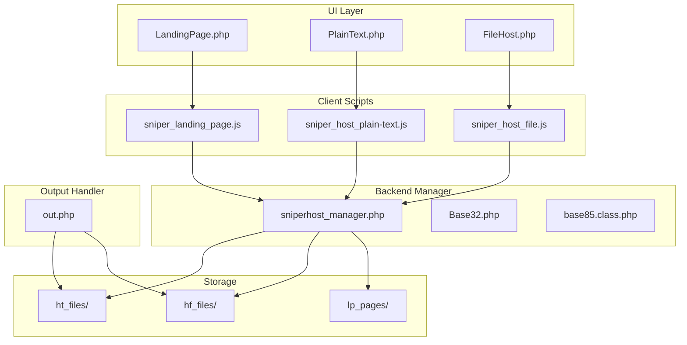
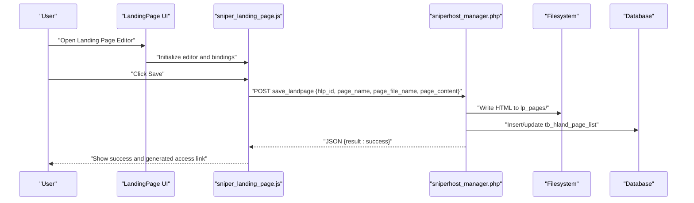
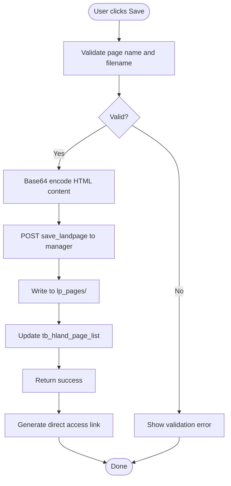
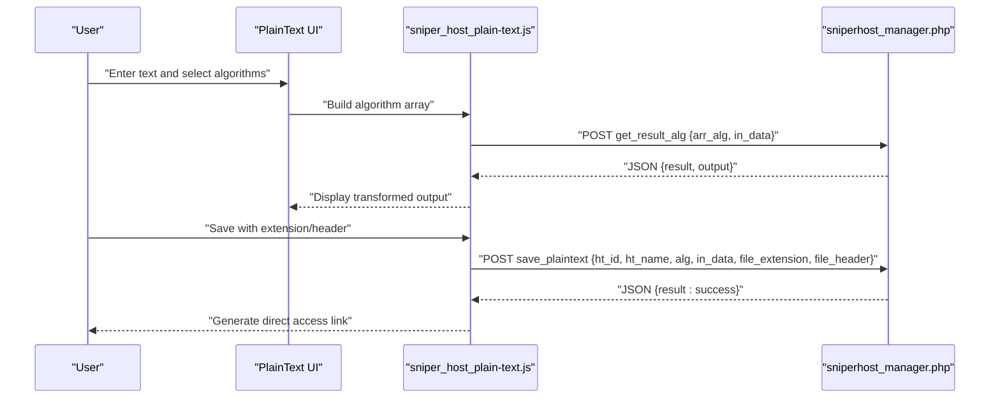
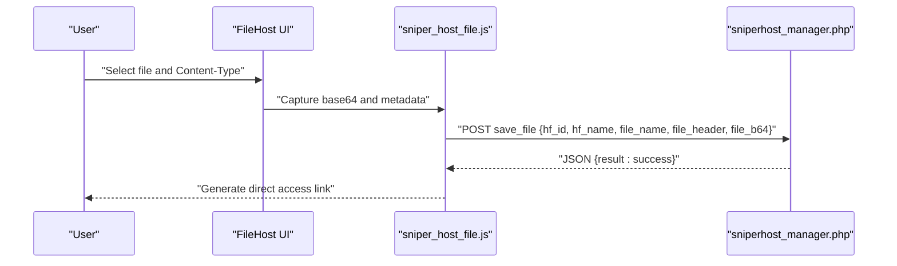
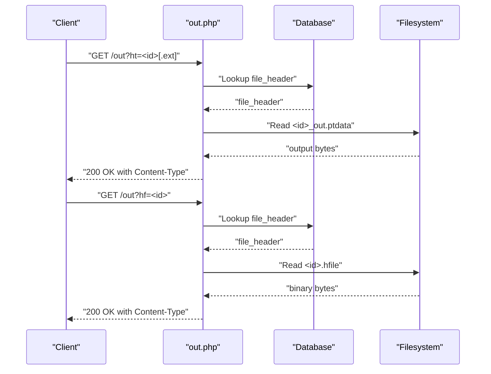
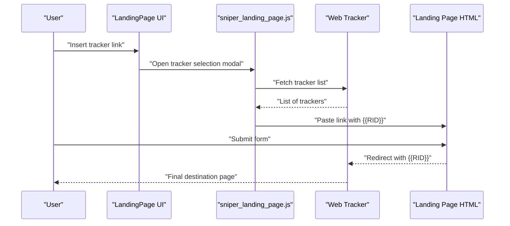
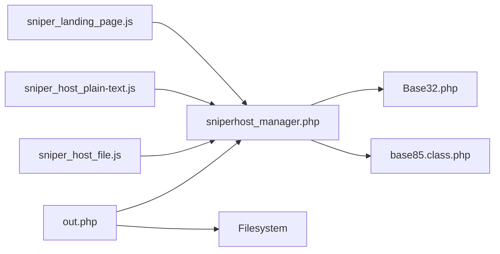

# Landing Page Integration

<cite>
**Referenced Files in This Document**
- [LandingPage.php](file://spear/sniperhost/LandingPage.php)
- [sniperhost_manager.php](file://spear/sniperhost/manager/sniperhost_manager.php)
- [out.php](file://spear/sniperhost/out.php)
- [FileHost.php](file://spear/sniperhost/FileHost.php)
- [PlainText.php](file://spear/sniperhost/PlainText.php)
- [sniper_landing_page.js](file://spear/sniperhost/js/sniper_landing_page.js)
- [sniper_host_file.js](file://spear/sniperhost/js/sniper_host_file.js)
- [sniper_host_plain-text.js](file://spear/sniperhost/js/sniper_host_plain-text.js)
- [Base32.php](file://spear/sniperhost/lib/Base32.php)
- [base85.class.php](file://spear/sniperhost/lib/base85.class.php)
- [hf_files README](file://spear/sniperhost/hf_files/README.md)
- [ht_files README](file://spear/sniperhost/ht_files/README.md)
</cite>

## Table of Contents
1. [Introduction](#introduction)
2. [Project Structure](#project-structure)
3. [Core Components](#core-components)
4. [Architecture Overview](#architecture-overview)
5. [Detailed Component Analysis](#detailed-component-analysis)
6. [Dependency Analysis](#dependency-analysis)
7. [Performance Considerations](#performance-considerations)
8. [Security and Access Control](#security-and-access-control)
9. [Troubleshooting Guide](#troubleshooting-guide)
10. [Conclusion](#conclusion)

## Introduction
This document explains the landing page hosting and integration functionality in the SniperPhish toolkit. It covers how to create and manage hosted landing pages, integrate web trackers, generate direct access links, handle file uploads and media insertion, and configure final destination URLs for seamless redirection after form submissions. It also documents the backend manager, output handlers, client-side editors, and security/access control mechanisms.

## Project Structure
The landing page hosting feature spans three main areas:
- Frontend UIs for creating and editing landing pages, plain-text hosting, and file hosting
- A shared manager backend that persists content and metadata to the database and filesystem
- An output handler that serves hosted content with appropriate headers

**Diagram sources**
- [LandingPage.php:1-320](file://spear/sniperhost/LandingPage.php#L1-L320)
- [PlainText.php:1-308](file://spear/sniperhost/PlainText.php#L1-L308)
- [FileHost.php:1-228](file://spear/sniperhost/FileHost.php#L1-L228)
- [sniper_landing_page.js:1-359](file://spear/sniperhost/js/sniper_landing_page.js#L1-L359)
- [sniper_host_plain-text.js:1-481](file://spear/sniperhost/js/sniper_host_plain-text.js#L1-L481)
- [sniper_host_file.js:1-228](file://spear/sniperhost/js/sniper_host_file.js#L1-L228)
- [sniperhost_manager.php:1-314](file://spear/sniperhost/manager/sniperhost_manager.php#L1-L314)
- [out.php:1-38](file://spear/sniperhost/out.php#L1-L38)
- [Base32.php:1-147](file://spear/sniperhost/lib/Base32.php#L1-L147)
- [base85.class.php:1-104](file://spear/sniperhost/lib/base85.class.php#L1-L104)
- [hf_files README:1-1](file://spear/sniperhost/hf_files/README.md#L1-L1)
- [ht_files README:1-1](file://spear/sniperhost/ht_files/README.md#L1-L1)

**Section sources**
- [LandingPage.php:1-320](file://spear/sniperhost/LandingPage.php#L1-L320)
- [PlainText.php:1-308](file://spear/sniperhost/PlainText.php#L1-L308)
- [FileHost.php:1-228](file://spear/sniperhost/FileHost.php#L1-L228)
- [sniperhost_manager.php:1-314](file://spear/sniperhost/manager/sniperhost_manager.php#L1-L314)
- [out.php:1-38](file://spear/sniperhost/out.php#L1-L38)

## Core Components
- LandingPage UI and Editor
  - Provides a WYSIWYG editor with media insertion (links, images, videos), tracker linking, and direct access link generation.
  - Stores HTML content to the filesystem and metadata to the database via the manager.
- Plain Text Hosting
  - Allows composing plain text, selecting encoding/transformations (Base32, Base85, URL encode, ROT13), setting file extension and Content-Type, and generating a direct access link.
- File Hosting
  - Supports uploading binary files, selecting Content-Type, and generating a direct access link.
- Manager Backend
  - Handles persistence of plaintext and file records, manages Base32/85 transformations, and saves landing page HTML.
- Output Handler
  - Serves hosted content with configured headers for plaintext and files.

**Section sources**
- [LandingPage.php:100-125](file://spear/sniperhost/LandingPage.php#L100-L125)
- [PlainText.php:96-204](file://spear/sniperhost/PlainText.php#L96-L204)
- [FileHost.php:94-127](file://spear/sniperhost/FileHost.php#L94-L127)
- [sniperhost_manager.php:53-112](file://spear/sniperhost/manager/sniperhost_manager.php#L53-L112)
- [out.php:14-36](file://spear/sniperhost/out.php#L14-L36)

## Architecture Overview
The system follows a client-server pattern:
- Client-side scripts initialize UIs, collect user input, and send JSON requests to the manager.
- The manager validates sessions, performs transformations (when applicable), writes to disk, and updates the database.
- The output handler reads stored content and serves it with appropriate headers.

**Diagram sources**
- [LandingPage.php:100-125](file://spear/sniperhost/LandingPage.php#L100-L125)
- [sniper_landing_page.js:161-191](file://spear/sniperhost/js/sniper_landing_page.js#L161-L191)
- [sniperhost_manager.php:246-269](file://spear/sniperhost/manager/sniperhost_manager.php#L246-L269)

## Detailed Component Analysis

### Landing Page Editor (HTML Editor, Media Support, Direct Access Links)
- Editor Features
  - Summernote-based WYSIWYG editor with code view, media insertion (link, image, video), and tracker insertion modal.
  - Media insertion dialogs validate URLs and paste appropriate HTML tags.
  - Tracker integration supports three display styles and {{RID}} placeholders.
- Storage and Retrieval
  - Saves HTML content to the lp_pages directory and stores metadata (page name, filename, date) in the database.
  - Generates direct access links using the current origin and the configured page filename.
- Workflow
  - On save, the editor posts base64-encoded HTML to the manager, which decodes and writes to disk.
  - Access links are generated client-side using the page filename.

**Diagram sources**
- [sniper_landing_page.js:193-206](file://spear/sniperhost/js/sniper_landing_page.js#L193-L206)
- [sniper_landing_page.js:170-191](file://spear/sniperhost/js/sniper_landing_page.js#L170-L191)
- [sniperhost_manager.php:246-269](file://spear/sniperhost/manager/sniperhost_manager.php#L246-L269)

**Section sources**
- [LandingPage.php:100-125](file://spear/sniperhost/LandingPage.php#L100-L125)
- [sniper_landing_page.js:1-359](file://spear/sniperhost/js/sniper_landing_page.js#L1-L359)
- [sniperhost_manager.php:246-269](file://spear/sniperhost/manager/sniperhost_manager.php#L246-L269)

### Plain Text Hosting (Encoding, File Extension, Content-Type)
- Editor Features
  - CodeMirror-based input/output with draggable algorithm list for transformations.
  - Supports Base32, Base85, Base64, ROT13, and URL encode.
  - Configurable file extension and Content-Type, including custom values.
- Transformation Pipeline
  - The manager applies the selected algorithms in order to produce the final output.
  - Outputs are saved to dedicated .out.ptdata files and metadata to the database.
- Direct Access Link
  - Generated using the configured extension and Content-Type header.

**Diagram sources**
- [PlainText.php:96-204](file://spear/sniperhost/PlainText.php#L96-L204)
- [sniper_host_plain-text.js:142-167](file://spear/sniperhost/js/sniper_host_plain-text.js#L142-L167)
- [sniperhost_manager.php:55-78](file://spear/sniperhost/manager/sniperhost_manager.php#L55-L78)
- [sniperhost_manager.php:80-112](file://spear/sniperhost/manager/sniperhost_manager.php#L80-L112)

**Section sources**
- [PlainText.php:96-204](file://spear/sniperhost/PlainText.php#L96-L204)
- [sniper_host_plain-text.js:1-481](file://spear/sniperhost/js/sniper_host_plain-text.js#L1-L481)
- [sniperhost_manager.php:55-112](file://spear/sniperhost/manager/sniperhost_manager.php#L55-L112)
- [Base32.php:1-147](file://spear/sniperhost/lib/Base32.php#L1-L147)
- [base85.class.php:1-104](file://spear/sniperhost/lib/base85.class.php#L1-L104)

### File Hosting (Upload Handling, Content-Type Headers)
- Upload Handling
  - Drag-and-drop or click-to-upload binary files; files are converted to base64 and stored on disk.
  - Enforces a maximum file size and allows selecting or specifying Content-Type headers.
- Metadata Management
  - Stores original filename, Content-Type, and date in the database.
- Direct Access Link
  - Generated using the host ID and served by the output handler.

**Diagram sources**
- [FileHost.php:94-127](file://spear/sniperhost/FileHost.php#L94-L127)
- [sniper_host_file.js:19-80](file://spear/sniperhost/js/sniper_host_file.js#L19-L80)
- [sniperhost_manager.php:160-203](file://spear/sniperhost/manager/sniperhost_manager.php#L160-L203)

**Section sources**
- [FileHost.php:94-127](file://spear/sniperhost/FileHost.php#L94-L127)
- [sniper_host_file.js:1-228](file://spear/sniperhost/js/sniper_host_file.js#L1-L228)
- [sniperhost_manager.php:160-203](file://spear/sniperhost/manager/sniperhost_manager.php#L160-L203)

### Output Handler (Content Serving and Headers)
- Plain Text Hosting
  - Reads stored output data and applies the configured Content-Type header before serving.
- File Hosting
  - Serves stored binary files with the configured Content-Type header.

**Diagram sources**
- [out.php:14-36](file://spear/sniperhost/out.php#L14-L36)

**Section sources**
- [out.php:1-38](file://spear/sniperhost/out.php#L1-L38)

### Relationship Between Web Trackers and Landing Pages
- Tracker Linking in Landing Pages
  - The editor provides a modal to select a web tracker and choose a display style.
  - {{RID}} placeholders are inserted for dynamic tracking identifiers.
- Final Destination URL Configuration
  - The landing page HTML can include links to the tracker’s first page with {{RID}} appended.
  - After form submissions, the tracker’s redirect mechanism handles final destination URL configuration.
- Seamless Redirection
  - The tracker’s embedded code and {{RID}} enable seamless redirection to the configured destination after user actions.

**Diagram sources**
- [sniper_landing_page.js:87-100](file://spear/sniperhost/js/sniper_landing_page.js#L87-L100)
- [sniper_landing_page.js:288-301](file://spear/sniperhost/js/sniper_landing_page.js#L288-L301)

**Section sources**
- [sniper_landing_page.js:18-40](file://spear/sniperhost/js/sniper_landing_page.js#L18-L40)
- [sniper_landing_page.js:288-301](file://spear/sniperhost/js/sniper_landing_page.js#L288-L301)

### Multi-Page Campaign Setup
- Use multiple landing pages to stage content and guide users through a sequence.
- Each page can embed tracker links with {{RID}} to maintain continuity across steps.
- Combine plain-text and file hosting to deliver diverse content types while preserving tracking.

[No sources needed since this section provides general guidance]

### Examples of Landing Page Creation Workflows
- Basic HTML Landing Page
  - Open the landing page editor, compose HTML, save, and copy the generated direct access link.
- Tracker-Integrated Landing Page
  - Compose HTML, insert a tracker link with a chosen style, and publish.
- Multi-Media Landing Page
  - Insert links, images, and videos using the media modals, then save and share the access link.

[No sources needed since this section provides general guidance]

## Dependency Analysis
- Client-side scripts depend on:
  - Summernote for rich text editing
  - CodeMirror for plain-text transformation preview
  - DataTables for listing and sorting
  - ClipboardJS for copying links
- Manager depends on:
  - Base32 and Base85 libraries for transformations
  - Database connectivity for persistence
- Output handler depends on:
  - Stored files and database metadata for serving

**Diagram sources**
- [sniper_landing_page.js:1-359](file://spear/sniperhost/js/sniper_landing_page.js#L1-L359)
- [sniper_host_plain-text.js:1-481](file://spear/sniperhost/js/sniper_host_plain-text.js#L1-L481)
- [sniper_host_file.js:1-228](file://spear/sniperhost/js/sniper_host_file.js#L1-L228)
- [sniperhost_manager.php:1-314](file://spear/sniperhost/manager/sniperhost_manager.php#L1-L314)
- [Base32.php:1-147](file://spear/sniperhost/lib/Base32.php#L1-L147)
- [base85.class.php:1-104](file://spear/sniperhost/lib/base85.class.php#L1-L104)
- [out.php:1-38](file://spear/sniperhost/out.php#L1-L38)

**Section sources**
- [sniper_landing_page.js:1-359](file://spear/sniperhost/js/sniper_landing_page.js#L1-L359)
- [sniper_host_plain-text.js:1-481](file://spear/sniperhost/js/sniper_host_plain-text.js#L1-L481)
- [sniper_host_file.js:1-228](file://spear/sniperhost/js/sniper_host_file.js#L1-L228)
- [sniperhost_manager.php:1-314](file://spear/sniperhost/manager/sniperhost_manager.php#L1-L314)
- [out.php:1-38](file://spear/sniperhost/out.php#L1-L38)

## Performance Considerations
- Prefer smaller images and compressed assets to reduce load times.
- Limit the number of embedded media resources on a single page.
- Use CDN-friendly direct access links for static assets referenced from landing pages.
- Keep HTML content concise to minimize server-side processing during save operations.

[No sources needed since this section provides general guidance]

## Security and Access Control
- Session Validation
  - All hosting UIs enforce session validation before rendering.
- File Upload Restrictions
  - Maximum file size enforced client-side and server-side checks for directories.
- Content-Type Controls
  - Content-Type headers are configurable but validated; avoid unsafe types.
- Storage Permissions
  - Ensure writable permissions only for intended directories (ht_files, hf_files, lp_pages).
- Data Validation
  - Validate filenames and extensions; avoid special characters and paths.
- Output Headers
  - The output handler respects stored headers; ensure they match intended content.

**Section sources**
- [LandingPage.php:2-3](file://spear/sniperhost/LandingPage.php#L2-L3)
- [FileHost.php:2-3](file://spear/sniperhost/FileHost.php#L2-L3)
- [PlainText.php:2-3](file://spear/sniperhost/PlainText.php#L2-L3)
- [sniper_host_file.js:22-32](file://spear/sniperhost/js/sniper_host_file.js#L22-L32)
- [sniperhost_manager.php:91-94](file://spear/sniperhost/manager/sniperhost_manager.php#L91-L94)
- [sniperhost_manager.php:167-170](file://spear/sniperhost/manager/sniperhost_manager.php#L167-L170)
- [sniperhost_manager.php:249-252](file://spear/sniperhost/manager/sniperhost_manager.php#L249-L252)
- [out.php:20-22](file://spear/sniperhost/out.php#L20-L22)
- [out.php:32-34](file://spear/sniperhost/out.php#L32-L34)

## Troubleshooting Guide
- Landing Page Save Fails
  - Verify directories exist and are writable (lp_pages).
  - Confirm page name and filename are provided.
  - Check for errors returned by the manager.
- File Upload Issues
  - Ensure the file size is under the limit.
  - Verify hf_files directory exists and is writable.
  - Re-upload if the file is missing from disk.
- Plain Text Encoding Problems
  - Confirm algorithms are selected and applied.
  - Check that the output matches expectations before saving.
- Direct Access Link Not Working
  - Validate the generated link and confirm the file exists on disk.
  - For plaintext, ensure the stored header is correct.
- Tracker Integration Failures
  - Ensure a web tracker exists and is selectable.
  - Confirm {{RID}} placeholders are present in the inserted link.
- Output Handler Errors
  - Verify the requested ID exists in the database.
  - Check stored headers and file presence.

**Section sources**
- [sniperhost_manager.php:91-94](file://spear/sniperhost/manager/sniperhost_manager.php#L91-L94)
- [sniperhost_manager.php:167-170](file://spear/sniperhost/manager/sniperhost_manager.php#L167-L170)
- [sniperhost_manager.php:249-252](file://spear/sniperhost/manager/sniperhost_manager.php#L249-L252)
- [sniper_landing_page.js:288-301](file://spear/sniperhost/js/sniper_landing_page.js#L288-L301)
- [sniper_host_file.js:116-121](file://spear/sniperhost/js/sniper_host_file.js#L116-L121)
- [sniper_host_plain-text.js:169-180](file://spear/sniperhost/js/sniper_host_plain-text.js#L169-L180)
- [out.php:14-36](file://spear/sniperhost/out.php#L14-L36)

## Conclusion
The landing page hosting system integrates a flexible editor, robust manager backend, and secure output handler to support multi-format content delivery with tracker integration. By following the workflows and best practices outlined above, operators can efficiently create, manage, and serve landing pages while maintaining control over access, headers, and security.