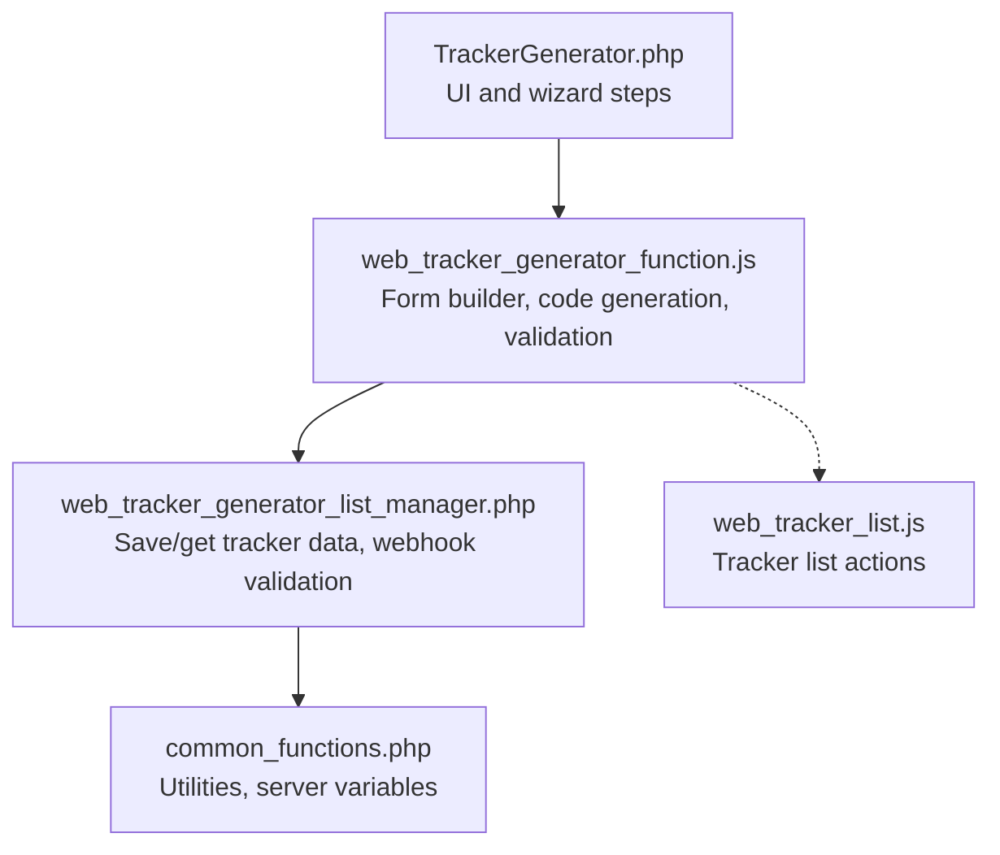
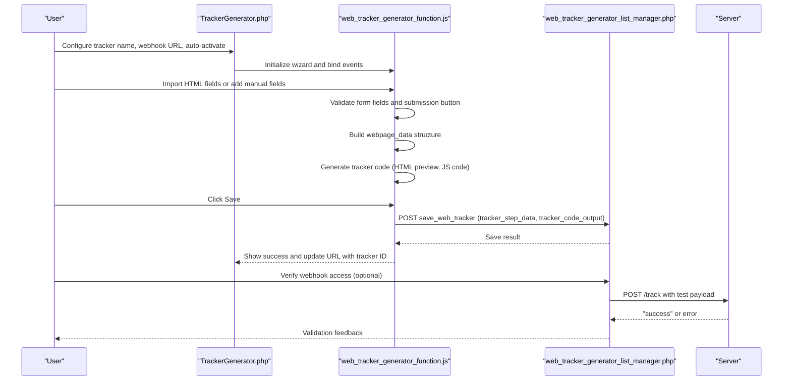
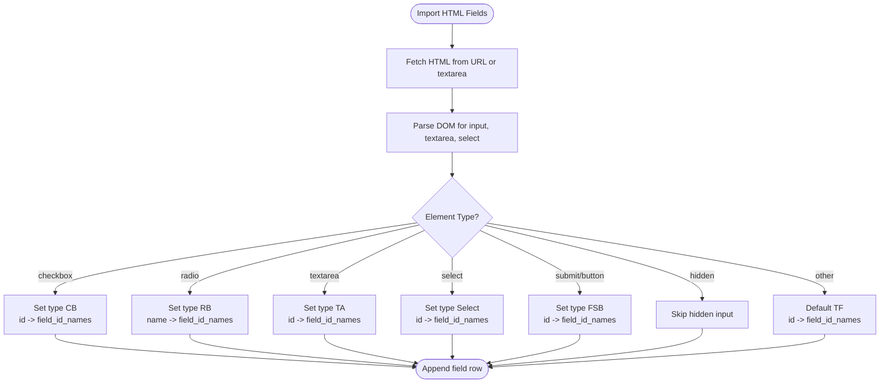
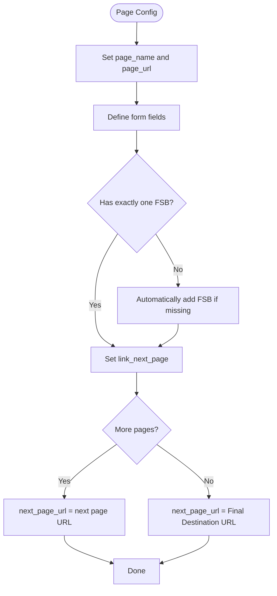
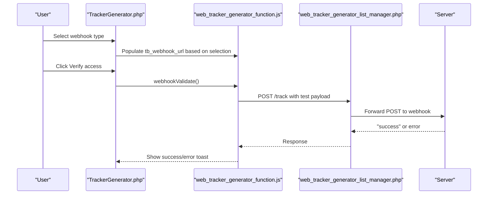
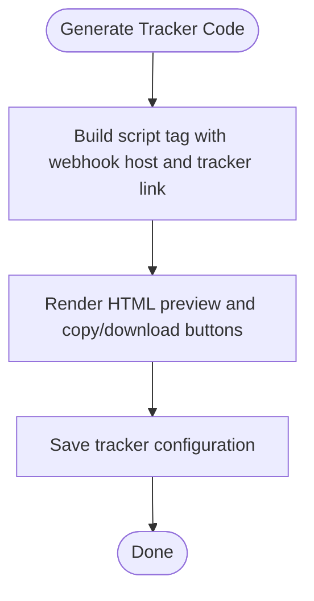
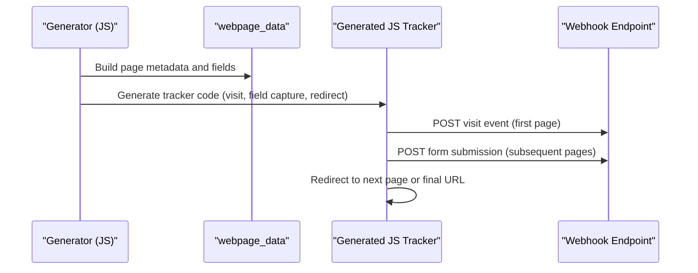
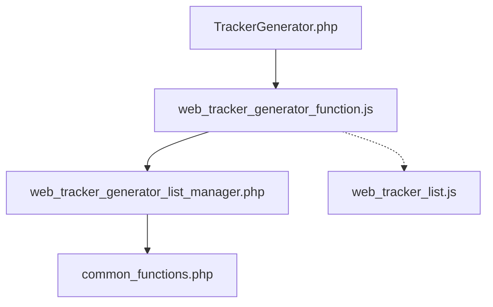

# Tracker Code Generation

<cite>
**Referenced Files in This Document**
- [TrackerGenerator.php](file://spear/TrackerGenerator.php)
- [web_tracker_generator_function.js](file://spear/js/web_tracker_generator_function.js)
- [web_tracker_generator_list_manager.php](file://spear/manager/web_tracker_generator_list_manager.php)
- [common_functions.php](file://spear/manager/common_functions.php)
- [web_tracker_list.js](file://spear/js/web_tracker_list.js)
</cite>

## Table of Contents
1. [Introduction](#introduction)
2. [Project Structure](#project-structure)
3. [Core Components](#core-components)
4. [Architecture Overview](#architecture-overview)
5. [Detailed Component Analysis](#detailed-component-analysis)
6. [Dependency Analysis](#dependency-analysis)
7. [Performance Considerations](#performance-considerations)
8. [Troubleshooting Guide](#troubleshooting-guide)
9. [Conclusion](#conclusion)

## Introduction
This document explains the tracker code generation component used to create JavaScript tracking code for multi-page phishing websites. It covers the step-by-step process of configuring tracker name, webhook URL, auto-activation, form field extraction via id/name attributes, validation of form submission buttons, multi-page configuration including final destination URL and page sequencing, and the relationship between the frontend generator and the underlying JavaScript implementation. It also documents download and preview features, common issues, and best practices.

## Project Structure
The tracker generation feature spans a PHP front-end page, a JavaScript generator, and a backend manager for persistence and validation.

**Diagram sources**
- [TrackerGenerator.php:1-429](file://spear/TrackerGenerator.php#L1-L429)
- [web_tracker_generator_function.js:1-881](file://spear/js/web_tracker_generator_function.js#L1-L881)
- [web_tracker_generator_list_manager.php:1-220](file://spear/manager/web_tracker_generator_list_manager.php#L1-L220)
- [common_functions.php:1-595](file://spear/manager/common_functions.php#L1-L595)
- [web_tracker_list.js:1-183](file://spear/js/web_tracker_list.js#L1-L183)

**Section sources**
- [TrackerGenerator.php:1-429](file://spear/TrackerGenerator.php#L1-L429)
- [web_tracker_generator_function.js:1-881](file://spear/js/web_tracker_generator_function.js#L1-L881)
- [web_tracker_generator_list_manager.php:1-220](file://spear/manager/web_tracker_generator_list_manager.php#L1-L220)
- [common_functions.php:1-595](file://spear/manager/common_functions.php#L1-L595)
- [web_tracker_list.js:1-183](file://spear/js/web_tracker_list.js#L1-L183)

## Core Components
- TrackerGenerator.php: Provides the wizard UI with steps for tracker name, webhook URL, auto-activation, multi-page configuration, and output previews.
- web_tracker_generator_function.js: Implements form field extraction, validation, tracker code generation, and preview rendering.
- web_tracker_generator_list_manager.php: Handles saving, loading, editing, and validating tracker configurations and webhook endpoints.
- common_functions.php: Supplies utilities like server variable retrieval and validation helpers.
- web_tracker_list.js: Manages tracker list operations (start/pause, copy, delete data).

**Section sources**
- [TrackerGenerator.php:76-199](file://spear/TrackerGenerator.php#L76-L199)
- [web_tracker_generator_function.js:1-881](file://spear/js/web_tracker_generator_function.js#L1-L881)
- [web_tracker_generator_list_manager.php:44-106](file://spear/manager/web_tracker_generator_list_manager.php#L44-L106)
- [common_functions.php:170-185](file://spear/manager/common_functions.php#L170-L185)
- [web_tracker_list.js:1-183](file://spear/js/web_tracker_list.js#L1-L183)

## Architecture Overview
The system follows a client-server architecture:
- Frontend: Wizard UI and JavaScript logic for building pages, extracting form fields, generating tracker code, and previewing outputs.
- Backend: Manager service for persisting tracker configurations and validating webhook accessibility.

**Diagram sources**
- [TrackerGenerator.php:295-409](file://spear/TrackerGenerator.php#L295-L409)
- [web_tracker_generator_function.js:427-763](file://spear/js/web_tracker_generator_function.js#L427-L763)
- [web_tracker_generator_list_manager.php:14-38](file://spear/manager/web_tracker_generator_list_manager.php#L14-L38)
- [web_tracker_generator_function.js:852-879](file://spear/js/web_tracker_generator_function.js#L852-L879)

## Detailed Component Analysis

### Step-by-Step Tracker Creation Process
- Step 1: Start
  - Enter tracker name and webhook URL.
  - Choose webhook type: SP base URL, current domain, or custom SP URL.
  - Auto-activate checkbox controls whether the tracker starts immediately after creation.
  - Validate webhook URL access via a verification call to the endpoint.
- Step 2: Web Pages
  - Add pages with page name and URL.
  - Import HTML fields from a live URL or paste HTML content.
  - Manually add form fields with type and id/name attribute.
  - Define a submission button per page (only one allowed).
  - Configure linking to the next page or final destination URL.
- Step 3: Output
  - Preview tracker code to place in the head section of each tracked page.
  - Preview generated HTML forms per page.
  - Download tracker code and preview ZIP of all pages.

**Section sources**
- [TrackerGenerator.php:82-146](file://spear/TrackerGenerator.php#L82-L146)
- [web_tracker_generator_function.js:135-222](file://spear/js/web_tracker_generator_function.js#L135-L222)
- [web_tracker_generator_function.js:385-420](file://spear/js/web_tracker_generator_function.js#L385-L420)
- [web_tracker_generator_function.js:427-666](file://spear/js/web_tracker_generator_function.js#L427-L666)

### Web Form Field Extraction Mechanism
- Extraction from URL or HTML content:
  - Uses DOM parsing to find input, textarea, and select elements.
  - Maps element types to field types (Text Field, Checkbox, Radio Button, Text Area, Select, Form Submit Button).
  - Uses id attribute for input elements; uses name attribute for radio groups.
  - Hidden inputs are ignored.
- Manual field management:
  - Add/remove fields dynamically.
  - Toggle tracking per field.
  - Submission button is automatically marked as tracked and disabled for toggling.

**Diagram sources**
- [web_tracker_generator_function.js:177-222](file://spear/js/web_tracker_generator_function.js#L177-L222)

**Section sources**
- [web_tracker_generator_function.js:177-222](file://spear/js/web_tracker_generator_function.js#L177-L222)
- [web_tracker_generator_function.js:239-255](file://spear/js/web_tracker_generator_function.js#L239-L255)

### Multi-Page Tracking Configuration
- Page sequence management:
  - Each page defines page name, URL, and linked next page URL.
  - Final destination URL is configured at the end step.
  - Next page URL defaults to the subsequent page’s URL; otherwise uses the final destination URL.
- Submission button validation:
  - Enforces exactly one submission button per page.
  - Highlights multiple submission buttons with validation feedback.

**Diagram sources**
- [web_tracker_generator_function.js:385-420](file://spear/js/web_tracker_generator_function.js#L385-L420)
- [TrackerGenerator.php:344-359](file://spear/TrackerGenerator.php#L344-L359)

**Section sources**
- [web_tracker_generator_function.js:385-420](file://spear/js/web_tracker_generator_function.js#L385-L420)
- [TrackerGenerator.php:344-384](file://spear/TrackerGenerator.php#L344-L384)

### Webhook URL Setup and Validation
- Webhook type selection:
  - SP base URL: populated from server variables.
  - Current domain: uses the current origin.
  - Custom SP URL: allows manual entry.
- Access verification:
  - Sends a test POST to the webhook endpoint’s track route.
  - Displays success or error feedback.

**Diagram sources**
- [TrackerGenerator.php:96-110](file://spear/TrackerGenerator.php#L96-L110)
- [web_tracker_generator_function.js:100-126](file://spear/js/web_tracker_generator_function.js#L100-L126)
- [web_tracker_generator_function.js:852-879](file://spear/js/web_tracker_generator_function.js#L852-L879)
- [web_tracker_generator_list_manager.php:165-178](file://spear/manager/web_tracker_generator_list_manager.php#L165-L178)

**Section sources**
- [TrackerGenerator.php:96-110](file://spear/TrackerGenerator.php#L96-L110)
- [web_tracker_generator_function.js:100-126](file://spear/js/web_tracker_generator_function.js#L100-L126)
- [web_tracker_generator_function.js:852-879](file://spear/js/web_tracker_generator_function.js#L852-L879)
- [web_tracker_generator_list_manager.php:165-178](file://spear/manager/web_tracker_generator_list_manager.php#L165-L178)

### Tracker Code Generation and Placement
- Generated tracker code:
  - A script tag referencing the webhook host with a tracker link parameter.
  - Must be placed inside the head section of each tracked page.
- Preview and download:
  - Copy/download buttons for tracker code and individual page HTML.
  - ZIP download of all pages with embedded tracker code.

**Diagram sources**
- [web_tracker_generator_function.js:427-441](file://spear/js/web_tracker_generator_function.js#L427-L441)
- [web_tracker_generator_function.js:688-725](file://spear/js/web_tracker_generator_function.js#L688-L725)

**Section sources**
- [web_tracker_generator_function.js:427-441](file://spear/js/web_tracker_generator_function.js#L427-L441)
- [web_tracker_generator_function.js:688-725](file://spear/js/web_tracker_generator_function.js#L688-L725)

### Relationship Between Generator and Underlying JavaScript Implementation
- The generator builds a structured dataset (webpage_data) containing page metadata, field definitions, and next page URLs.
- The generator produces:
  - HTML preview for each page.
  - A JavaScript tracker that:
    - Initializes session cookies.
    - Detects IP information and sends visit events for the first page.
    - Captures form field values on submission and posts to the webhook.
    - Redirects to the next page or final destination upon submission.

**Diagram sources**
- [web_tracker_generator_function.js:385-420](file://spear/js/web_tracker_generator_function.js#L385-L420)
- [web_tracker_generator_function.js:478-646](file://spear/js/web_tracker_generator_function.js#L478-L646)

**Section sources**
- [web_tracker_generator_function.js:385-420](file://spear/js/web_tracker_generator_function.js#L385-L420)
- [web_tracker_generator_function.js:478-646](file://spear/js/web_tracker_generator_function.js#L478-L646)

### Practical Examples
- Tracker code placement:
  - Place the generated script tag inside the head section of each tracked page.
- Form field identification patterns:
  - Text inputs: use id attribute.
  - Checkboxes: use id attribute.
  - Radio buttons: use name attribute for grouping.
  - Text areas and selects: use id attribute.
  - Submission buttons: use id attribute and ensure only one per page.
- Webhook URL validation:
  - Use the Verify access button to confirm the endpoint responds with success.

**Section sources**
- [web_tracker_generator_function.js:177-222](file://spear/js/web_tracker_generator_function.js#L177-L222)
- [web_tracker_generator_function.js:852-879](file://spear/js/web_tracker_generator_function.js#L852-L879)

## Dependency Analysis
- TrackerGenerator.php depends on:
  - web_tracker_generator_function.js for UI interactions and code generation.
  - web_tracker_generator_list_manager.php for saving and retrieving tracker data.
- web_tracker_generator_function.js depends on:
  - jQuery and Select2 for UI interactions.
  - ClipboardJS and Prism for copying and syntax highlighting.
  - JSZip for ZIP downloads.
- web_tracker_generator_list_manager.php depends on:
  - common_functions.php for server variable retrieval and utilities.

**Diagram sources**
- [TrackerGenerator.php:280-291](file://spear/TrackerGenerator.php#L280-L291)
- [web_tracker_generator_function.js:1-5](file://spear/js/web_tracker_generator_function.js#L1-L5)
- [web_tracker_generator_list_manager.php:1-10](file://spear/manager/web_tracker_generator_list_manager.php#L1-L10)
- [common_functions.php:170-185](file://spear/manager/common_functions.php#L170-L185)
- [web_tracker_list.js:1-10](file://spear/js/web_tracker_list.js#L1-L10)

**Section sources**
- [TrackerGenerator.php:280-291](file://spear/TrackerGenerator.php#L280-L291)
- [web_tracker_generator_function.js:1-5](file://spear/js/web_tracker_generator_function.js#L1-L5)
- [web_tracker_generator_list_manager.php:1-10](file://spear/manager/web_tracker_generator_list_manager.php#L1-L10)
- [common_functions.php:170-185](file://spear/manager/common_functions.php#L170-L185)
- [web_tracker_list.js:1-10](file://spear/js/web_tracker_list.js#L1-L10)

## Performance Considerations
- Minimize DOM parsing overhead by limiting repeated reflows and re-renders during dynamic field addition/removal.
- Use efficient selectors and batch updates when manipulating form fields.
- Avoid unnecessary network requests; cache server base URL and webhook host.

## Troubleshooting Guide
- Invalid webhook URL:
  - Ensure the URL is reachable and responds to POST requests at the /track endpoint.
  - Use the Verify access button to test connectivity.
- Missing form fields:
  - Confirm that inputs have either id or name attributes as applicable.
  - Hidden inputs are intentionally ignored; ensure sensitive fields are not hidden.
- Multiple submission buttons:
  - Only one submission button per page is allowed; the generator enforces this.
- Tracker code placement errors:
  - The tracker script must be placed in the head section of each tracked page.
  - Ensure the script tag references the correct webhook host and tracker link parameter.
- Download and preview issues:
  - Copy/download relies on ClipboardJS and Blob APIs; ensure browser support.
  - ZIP generation uses JSZip; verify browser compatibility.

**Section sources**
- [web_tracker_generator_function.js:852-879](file://spear/js/web_tracker_generator_function.js#L852-L879)
- [web_tracker_generator_function.js:177-222](file://spear/js/web_tracker_generator_function.js#L177-L222)
- [web_tracker_generator_function.js:314-316](file://spear/js/web_tracker_generator_function.js#L314-L316)
- [web_tracker_generator_function.js:688-725](file://spear/js/web_tracker_generator_function.js#L688-L725)

## Conclusion
The tracker code generation component provides a robust workflow for creating multi-page tracking scripts tailored to phishing websites. It automates form field extraction, enforces validation rules, generates previews and downloadable artifacts, and integrates with a backend manager for persistence and webhook verification. Following the documented steps and best practices ensures reliable tracking and reporting.