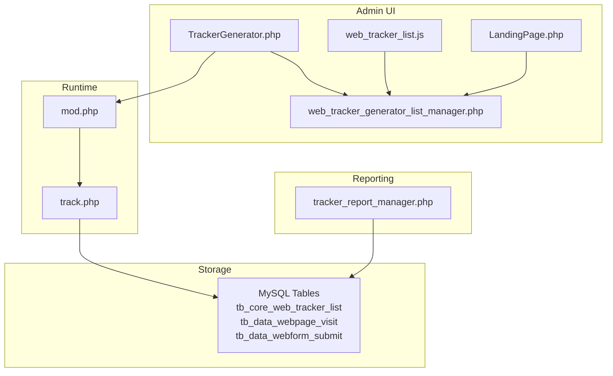
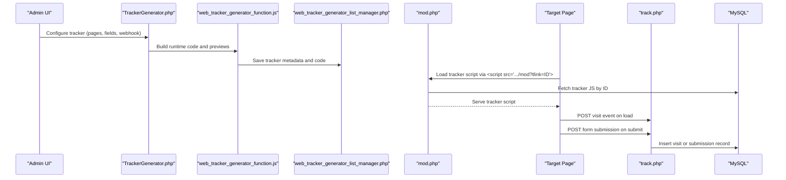
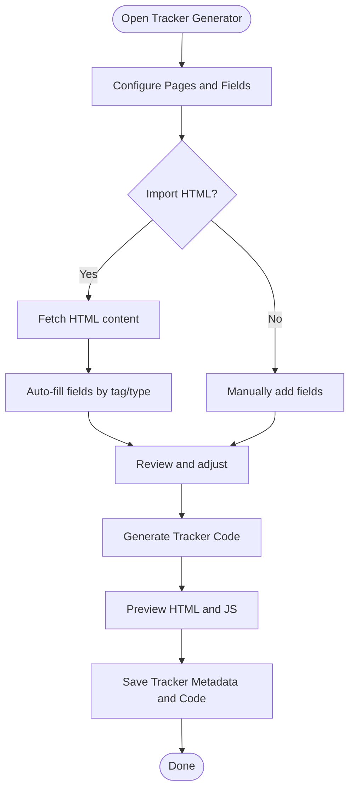
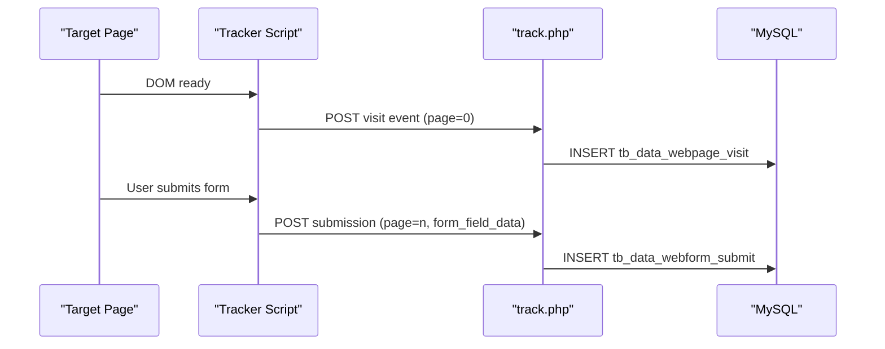
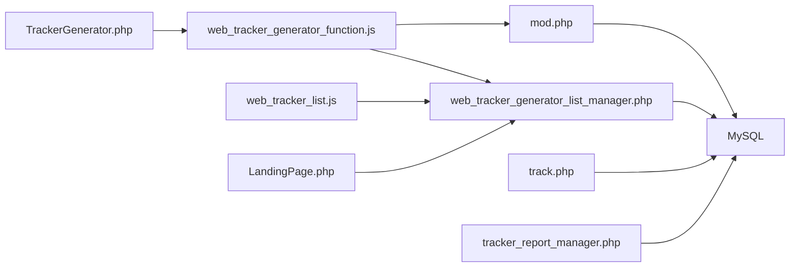

# Web Tracker System

<cite>
**Referenced Files in This Document**
- [TrackerGenerator.php](file://spear/TrackerGenerator.php)
- [web_tracker_generator_function.js](file://spear/js/web_tracker_generator_function.js)
- [web_tracker_list.js](file://spear/js/web_tracker_list.js)
- [track.php](file://track.php)
- [web_tracker_generator_list_manager.php](file://spear/manager/web_tracker_generator_list_manager.php)
- [LandingPage.php](file://spear/sniperhost/LandingPage.php)
- [tracker_report_manager.php](file://spear/manager/tracker_report_manager.php)
- [install_manager.php](file://install_manager.php)
- [mod.php](file://mod.php)
</cite>

## Table of Contents
1. [Introduction](#introduction)
2. [Project Structure](#project-structure)
3. [Core Components](#core-components)
4. [Architecture Overview](#architecture-overview)
5. [Detailed Component Analysis](#detailed-component-analysis)
6. [Dependency Analysis](#dependency-analysis)
7. [Performance Considerations](#performance-considerations)
8. [Troubleshooting Guide](#troubleshooting-guide)
9. [Conclusion](#conclusion)
10. [Appendices](#appendices)

## Introduction
This document explains the web tracker system used to monitor website visits and form submissions for phishing campaigns. It covers how the tracker code is generated via the Tracker Generator, how multi-page tracking is configured, how form fields are extracted and tracked, how the webhook endpoint collects and stores data, and how dashboards visualize the results. It also clarifies the relationship between landing page hosting and web tracking, and provides practical examples and troubleshooting guidance.

## Project Structure
The web tracker spans several frontend and backend components:
- Frontend generator and preview: TrackerGenerator.php and web_tracker_generator_function.js
- Tracker runtime injection: mod.php serves the tracker script dynamically
- Data collection: track.php receives tracking events and writes to MySQL
- Management and reporting: web_tracker_list.js, web_tracker_generator_list_manager.php, tracker_report_manager.php
- Landing page hosting integration: LandingPage.php allows linking trackers to hosted pages

**Diagram sources**
- [TrackerGenerator.php:1-429](file://spear/TrackerGenerator.php#L1-L429)
- [web_tracker_generator_function.js:1-881](file://spear/js/web_tracker_generator_function.js#L1-L881)
- [web_tracker_list.js:1-211](file://spear/js/web_tracker_list.js#L1-L211)
- [LandingPage.php:1-320](file://spear/sniperhost/LandingPage.php#L1-L320)
- [web_tracker_generator_list_manager.php:1-220](file://spear/manager/web_tracker_generator_list_manager.php#L1-L220)
- [mod.php:45-56](file://mod.php#L45-L56)
- [track.php:1-88](file://track.php#L1-L88)
- [tracker_report_manager.php:1-223](file://spear/manager/tracker_report_manager.php#L1-L223)

**Section sources**
- [TrackerGenerator.php:1-429](file://spear/TrackerGenerator.php#L1-L429)
- [web_tracker_generator_function.js:1-881](file://spear/js/web_tracker_generator_function.js#L1-L881)
- [web_tracker_list.js:1-211](file://spear/js/web_tracker_list.js#L1-L211)
- [LandingPage.php:1-320](file://spear/sniperhost/LandingPage.php#L1-L320)
- [web_tracker_generator_list_manager.php:1-220](file://spear/manager/web_tracker_generator_list_manager.php#L1-L220)
- [track.php:1-88](file://track.php#L1-L88)
- [tracker_report_manager.php:1-223](file://spear/manager/tracker_report_manager.php#L1-L223)
- [install_manager.php:350-415](file://install_manager.php#L350-L415)

## Core Components
- Tracker Code Generator: Builds multi-page tracking configurations, extracts form fields, generates tracker code, and previews HTML forms and scripts.
- Runtime Tracker Loader: Serves the tracker script to target pages via a dynamic endpoint.
- Webhook Endpoint: Receives tracking events (visits and form submissions), validates state, and persists data.
- Management UI: Lists trackers, controls activation, copies, deletes, and clears data.
- Reporting Engine: Queries and exports captured data for visualization and analysis.
- Landing Page Hosting: Integrates trackers with hosted pages and generates access links.

**Section sources**
- [TrackerGenerator.php:70-199](file://spear/TrackerGenerator.php#L70-L199)
- [web_tracker_generator_function.js:427-666](file://spear/js/web_tracker_generator_function.js#L427-L666)
- [mod.php:45-56](file://mod.php#L45-L56)
- [track.php:1-88](file://track.php#L1-L88)
- [web_tracker_list.js:1-211](file://spear/js/web_tracker_list.js#L1-L211)
- [tracker_report_manager.php:1-223](file://spear/manager/tracker_report_manager.php#L1-L223)
- [LandingPage.php:183-215](file://spear/sniperhost/LandingPage.php#L183-L215)

## Architecture Overview
The system follows a client-side tracking model:
- Admin builds a tracker with multi-page steps and form fields.
- Generated tracker script is injected into target pages via a small loader tag.
- On page load, the tracker sends a visit event to the webhook.
- On form submit, the tracker serializes field values and sends a submission event.
- Events are validated against tracker state and persisted to MySQL.
- Reports and dashboards visualize the collected data.

**Diagram sources**
- [TrackerGenerator.php:292-409](file://spear/TrackerGenerator.php#L292-L409)
- [web_tracker_generator_function.js:427-666](file://spear/js/web_tracker_generator_function.js#L427-L666)
- [web_tracker_generator_list_manager.php:44-69](file://spear/manager/web_tracker_generator_list_manager.php#L44-L69)
- [mod.php:45-56](file://mod.php#L45-L56)
- [track.php:54-83](file://track.php#L54-L83)

## Detailed Component Analysis

### Tracker Code Generation (TrackerGenerator.php + web_tracker_generator_function.js)
- Multi-page configuration:
  - Pages are defined with a name, URL, and optional “link to next page” flag.
  - Final destination URL is set for post-submit redirection.
- Form field extraction:
  - Manual entry of field types (text, checkbox, radio, textarea, select, submit button).
  - Import HTML fields from a URL or raw HTML to auto-populate fields and IDs.
  - Each field can be marked for tracking or ignored.
- Dynamic tracker insertion:
  - Generates a small loader script tag pointing to the runtime endpoint with a tracker ID.
  - Produces preview HTML for each page and a consolidated tracker script.
- Saving and editing:
  - Saves tracker metadata and code to the database.
  - Loads existing trackers for editing and repopulates the UI.

**Diagram sources**
- [TrackerGenerator.php:130-199](file://spear/TrackerGenerator.php#L130-L199)
- [web_tracker_generator_function.js:135-222](file://spear/js/web_tracker_generator_function.js#L135-L222)
- [web_tracker_generator_function.js:385-420](file://spear/js/web_tracker_generator_function.js#L385-L420)
- [web_tracker_generator_function.js:427-666](file://spear/js/web_tracker_generator_function.js#L427-L666)

**Section sources**
- [TrackerGenerator.php:70-199](file://spear/TrackerGenerator.php#L70-L199)
- [web_tracker_generator_function.js:1-881](file://spear/js/web_tracker_generator_function.js#L1-L881)

### Runtime Tracker Loader (mod.php)
- Serves the tracker script content for a given tracker ID.
- Returns JavaScript content type and the stored tracker payload.

**Section sources**
- [mod.php:45-56](file://mod.php#L45-L56)

### Webhook Integration (track.php)
- Validates incoming requests and checks tracker activity.
- Distinguishes between page visit (page equals zero) and form submission events.
- Collects device and IP info, serializes form field data, and inserts records into appropriate tables.

**Diagram sources**
- [track.php:54-83](file://track.php#L54-L83)

**Section sources**
- [track.php:1-88](file://track.php#L1-L88)

### Tracker Management (web_tracker_list.js + web_tracker_generator_list_manager.php)
- Lists trackers with actions: start/resume, pause/stop, edit, delete, delete data, copy, copy tracker link.
- Persists tracker state and code, and supports importing tracker data for editing.

**Section sources**
- [web_tracker_list.js:1-211](file://spear/js/web_tracker_list.js#L1-L211)
- [web_tracker_generator_list_manager.php:1-220](file://spear/manager/web_tracker_generator_list_manager.php#L1-L220)

### Landing Page Hosting and Web Tracker Linking (LandingPage.php)
- Allows creating hosted landing pages and generating direct access links.
- Provides a modal to link a selected web tracker to a hosted page with configurable display styles.

**Section sources**
- [LandingPage.php:183-215](file://spear/sniperhost/LandingPage.php#L183-L215)

### Reporting and Data Export (tracker_report_manager.php)
- Retrieves paginated data for visits or submissions.
- Supports CSV, PDF, and HTML export with customizable columns including IP-derived fields and form field values.

**Section sources**
- [tracker_report_manager.php:1-223](file://spear/manager/tracker_report_manager.php#L1-L223)

## Dependency Analysis
- UI depends on jQuery, Select2, DataTables, and Prism for previews.
- Generator relies on a manager endpoint for saving, loading, and validating tracker data.
- Runtime depends on the loader endpoint to serve the correct tracker script.
- Endpoint depends on database tables for persistence and BrowserDetection library for UA parsing.

**Diagram sources**
- [TrackerGenerator.php:291-426](file://spear/TrackerGenerator.php#L291-L426)
- [web_tracker_generator_function.js:1-881](file://spear/js/web_tracker_generator_function.js#L1-L881)
- [web_tracker_generator_list_manager.php:1-220](file://spear/manager/web_tracker_generator_list_manager.php#L1-L220)
- [mod.php:45-56](file://mod.php#L45-L56)
- [track.php:1-88](file://track.php#L1-L88)
- [web_tracker_list.js:1-211](file://spear/js/web_tracker_list.js#L1-L211)
- [LandingPage.php:183-215](file://spear/sniperhost/LandingPage.php#L183-L215)
- [tracker_report_manager.php:1-223](file://spear/manager/tracker_report_manager.php#L1-L223)

**Section sources**
- [TrackerGenerator.php:291-426](file://spear/TrackerGenerator.php#L291-L426)
- [web_tracker_generator_function.js:1-881](file://spear/js/web_tracker_generator_function.js#L1-L881)
- [web_tracker_generator_list_manager.php:1-220](file://spear/manager/web_tracker_generator_list_manager.php#L1-L220)
- [track.php:1-88](file://track.php#L1-L88)
- [web_tracker_list.js:1-211](file://spear/js/web_tracker_list.js#L1-L211)
- [LandingPage.php:183-215](file://spear/sniperhost/LandingPage.php#L183-L215)
- [tracker_report_manager.php:1-223](file://spear/manager/tracker_report_manager.php#L1-L223)

## Performance Considerations
- Minimize tracker payload size by disabling non-critical tracking fields.
- Use asynchronous tracking where possible to avoid blocking form submission.
- Ensure the webhook endpoint is reachable and not rate-limited by the target network.
- Keep the number of tracked pages reasonable to reduce payload size and processing overhead.

## Troubleshooting Guide
Common issues and resolutions:
- Tracker not firing:
  - Verify the loader script tag is placed inside the page head section and points to the correct webhook host.
  - Confirm the tracker is active in the management UI.
- Form fields not recorded:
  - Ensure each tracked field has a unique id or name attribute as applicable.
  - Confirm the field type selection matches the HTML element.
- Multi-page flow not working:
  - Set a single “Form Submit Button” per page.
  - Ensure “link to next page” is enabled when a subsequent page exists.
- Webhook validation fails:
  - Use the built-in validator to test connectivity to the webhook endpoint.
  - Check CORS headers and server configuration if the endpoint is external.
- Data not appearing in reports:
  - Confirm the tracker is active and events are being sent.
  - Verify database connectivity and that the tables exist.

**Section sources**
- [web_tracker_generator_function.js:852-879](file://spear/js/web_tracker_generator_function.js#L852-L879)
- [track.php:54-83](file://track.php#L54-L83)
- [web_tracker_list.js:1-211](file://spear/js/web_tracker_list.js#L1-L211)

## Conclusion
The web tracker system provides a flexible, admin-driven mechanism to monitor visits and form submissions across multi-page phishing sites. By combining a powerful generator, a lightweight runtime loader, a robust webhook endpoint, and comprehensive reporting, it enables precise tracking and actionable insights while maintaining simplicity for deployment.

## Appendices

### Database Schema Overview
- Core tracker metadata and code:
  - Table: tb_core_web_tracker_list
  - Columns include identifiers, names, content payloads, step data, timestamps, and activation state.
- Visit events:
  - Table: tb_data_webpage_visit
  - Columns include tracker identifier, session, request identifier, IP, IP info, user agent, screen resolution, timestamp, browser, platform, and device type.
- Submission events:
  - Table: tb_data_webform_submit
  - Columns include tracker identifier, session, request identifier, IP, IP info, user agent, screen resolution, timestamp, browser, platform, device type, page index, and serialized form field data.

**Section sources**
- [install_manager.php:350-415](file://install_manager.php#L350-L415)

### Practical Examples
- Placing the tracker loader in the HTML head:
  - Add a script tag referencing the runtime endpoint with the tracker ID.
- Identifying form fields:
  - Use unique id attributes for text inputs, textarea, select, and checkboxes.
  - Use name attributes for radio button groups.
  - Assign unique id attributes to the submit button.
- Multi-page campaign configuration:
  - Define each page with a URL and optional “link to next page.”
  - Place a single submit button per page and set the final destination URL.

[No sources needed since this section provides general guidance]