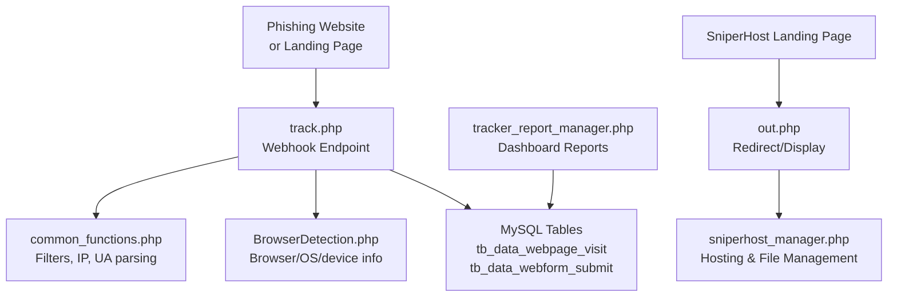
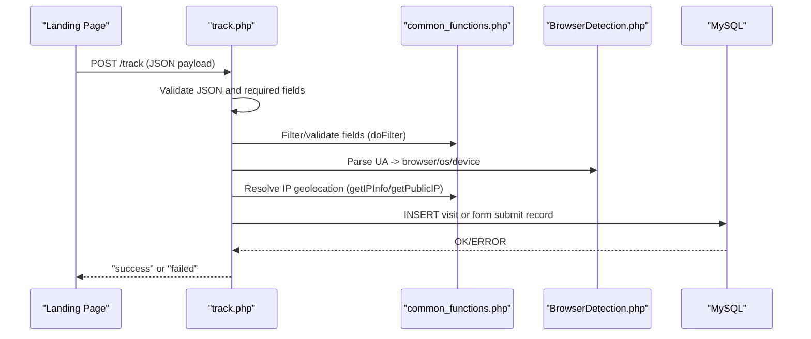
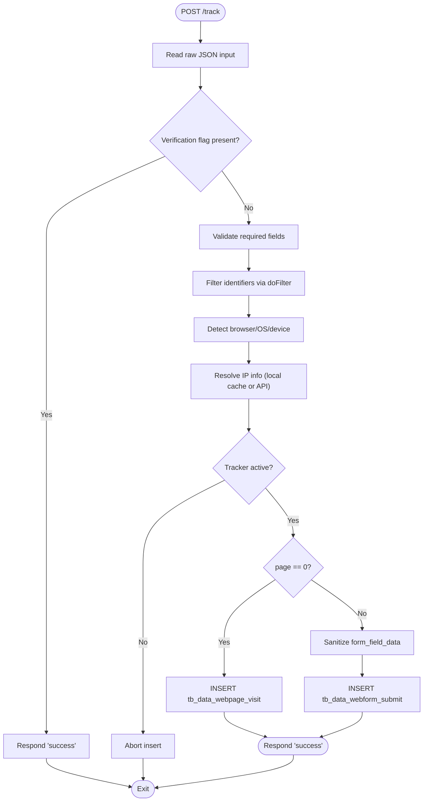
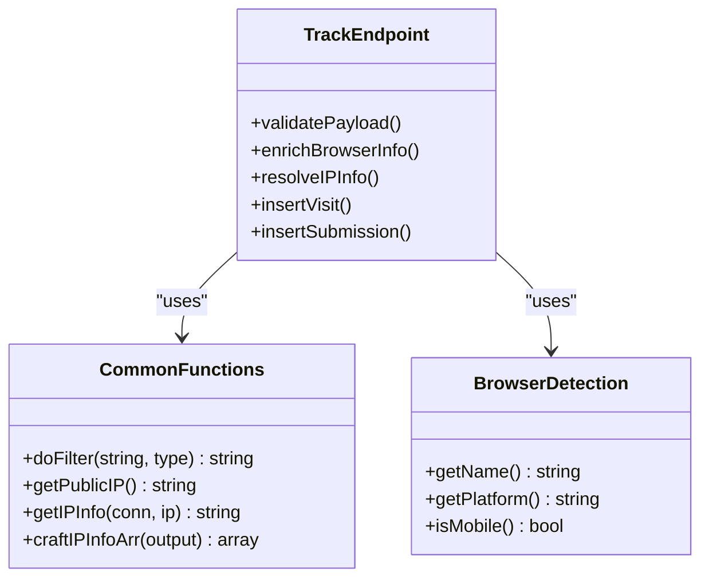
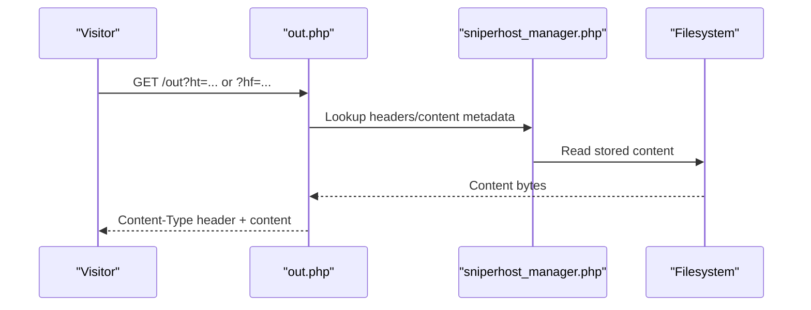
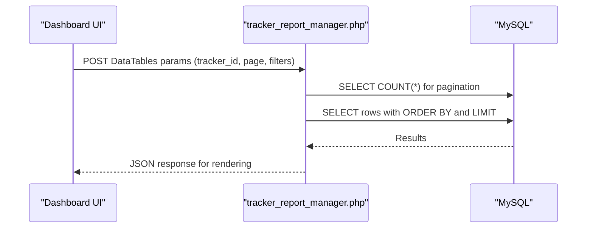
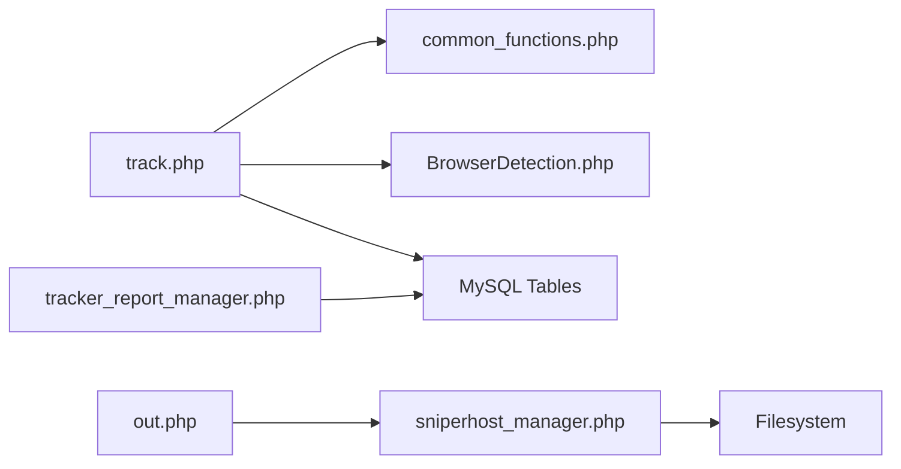

# Webhook Processing System

<cite>
**Referenced Files in This Document**
- [track.php](file://track.php)
- [common_functions.php](file://spear/manager/common_functions.php)
- [BrowserDetection.php](file://spear/libs/browser_detect/BrowserDetection.php)
- [install_manager.php](file://install_manager.php)
- [web_tracker_generator_function.js](file://spear/js/web_tracker_generator_function.js)
- [out.php](file://spear/sniperhost/out.php)
- [sniperhost_manager.php](file://spear/sniperhost/manager/sniperhost_manager.php)
- [LandingPage.php](file://spear/sniperhost/LandingPage.php)
- [tracker_report_manager.php](file://spear/manager/tracker_report_manager.php)
</cite>

## Table of Contents
1. [Introduction](#introduction)
2. [Project Structure](#project-structure)
3. [Core Components](#core-components)
4. [Architecture Overview](#architecture-overview)
5. [Detailed Component Analysis](#detailed-component-analysis)
6. [Dependency Analysis](#dependency-analysis)
7. [Performance Considerations](#performance-considerations)
8. [Troubleshooting Guide](#troubleshooting-guide)
9. [Conclusion](#conclusion)

## Introduction
This document describes the webhook processing system used by SniperPhish to receive and process tracking events from phishing landing pages. The system exposes a track endpoint that validates incoming requests, parses payloads, enriches data with browser and IP geolocation, and securely stores the results in MySQL tables for dashboard visualization. It also integrates with the sniperhost subsystem to coordinate landing page redirection and tracking.

## Project Structure
The webhook pipeline spans several components:
- Webhook endpoint: track.php
- Shared utilities: common_functions.php
- Browser detection library: BrowserDetection.php
- Database schema: install_manager.php (tables for visits and form submissions)
- Frontend validation: web_tracker_generator_function.js
- Sniperhost integration: out.php and sniperhost_manager.php
- Dashboard reporting: tracker_report_manager.php

**Diagram sources**
- [track.php:1-88](file://track.php#L1-L88)
- [common_functions.php:447-458](file://spear/manager/common_functions.php#L447-L458)
- [BrowserDetection.php:537-551](file://spear/libs/browser_detect/BrowserDetection.php#L537-L551)
- [install_manager.php:379-415](file://install_manager.php#L379-L415)
- [out.php:1-38](file://spear/sniperhost/out.php#L1-L38)
- [sniperhost_manager.php:16-51](file://spear/sniperhost/manager/sniperhost_manager.php#L16-L51)
- [tracker_report_manager.php:112-144](file://spear/manager/tracker_report_manager.php#L112-L144)

**Section sources**
- [track.php:1-88](file://track.php#L1-L88)
- [install_manager.php:379-415](file://install_manager.php#L379-L415)

## Core Components
- track.php: Validates requests, extracts and sanitizes payload fields, detects browser/OS/device, resolves IP geolocation, checks tracker status, and inserts records into appropriate tables.
- common_functions.php: Provides filtering utilities, IP resolution, browser identification helpers, and shared database helpers used by the webhook and other modules.
- BrowserDetection.php: Detects browser name/version, platform, and device type from the user agent.
- install_manager.php: Defines database schemas for storing page visits and form submissions.
- web_tracker_generator_function.js: Validates webhook endpoint accessibility via a test request.
- out.php and sniperhost_manager.php: Serve hosted content and manage landing page assets for sniperhost.
- tracker_report_manager.php: Implements backend logic for paginated, searchable, and sortable reports on tracked events.

**Section sources**
- [track.php:19-83](file://track.php#L19-L83)
- [common_functions.php:447-458](file://spear/manager/common_functions.php#L447-L458)
- [BrowserDetection.php:537-551](file://spear/libs/browser_detect/BrowserDetection.php#L537-L551)
- [install_manager.php:379-415](file://install_manager.php#L379-L415)
- [web_tracker_generator_function.js:852-879](file://spear/js/web_tracker_generator_function.js#L852-L879)
- [out.php:1-38](file://spear/sniperhost/out.php#L1-L38)
- [sniperhost_manager.php:16-51](file://spear/sniperhost/manager/sniperhost_manager.php#L16-L51)
- [tracker_report_manager.php:112-144](file://spear/manager/tracker_report_manager.php#L112-L144)

## Architecture Overview
The webhook receives JSON payloads from landing pages, performs validation and enrichment, and persists structured data into MySQL. The dashboard queries these tables to present analytics.

**Diagram sources**
- [track.php:9-83](file://track.php#L9-L83)
- [common_functions.php:447-458](file://spear/manager/common_functions.php#L447-L458)
- [BrowserDetection.php:537-551](file://spear/libs/browser_detect/BrowserDetection.php#L537-L551)

## Detailed Component Analysis

### track.php: Webhook Endpoint Implementation
Responsibilities:
- Accepts JSON payloads via POST.
- Supports a verification handshake via a special field.
- Extracts and sanitizes fields (tracker identifiers, session/page info, screen resolution).
- Detects browser/OS/device from user agent.
- Resolves IP geolocation using internal helpers or supplied data.
- Checks tracker active status before recording.
- Inserts either a page visit or form submission record depending on the page identifier.

Key behaviors:
- Request validation: Ensures JSON input exists and decodes successfully.
- Verification: Responds immediately with a success marker for a dedicated field.
- Sanitization: Uses a filtering utility to strip non-alphanumeric characters for identifiers.
- Enrichment: Browser/OS/device via external library; IP via helper functions.
- Conditional insert: Distinguishes page visit vs form submission by page value.
- Error handling: Returns minimal error messages on database failure.

**Diagram sources**
- [track.php:9-83](file://track.php#L9-L83)
- [common_functions.php:447-458](file://spear/manager/common_functions.php#L447-L458)
- [BrowserDetection.php:537-551](file://spear/libs/browser_detect/BrowserDetection.php#L537-L551)

**Section sources**
- [track.php:9-83](file://track.php#L9-L83)

### Payload Structure and Field Semantics
The webhook expects a JSON payload with the following semantics:
- sp_ver: Optional verification field to trigger a success response.
- rid: Required; resource or campaign identifier.
- sess_id: Optional; session identifier.
- trackerId: Required; tracker identifier.
- page: Required; numeric identifier for the page or 0 to indicate a visit.
- screen_res: Optional; screen resolution string.
- form_field_data: Required when page is numeric; array of submitted field values.
- ip_info: Optional; if omitted, the system attempts to resolve geolocation.

Storage fields per record:
- Page visit: tracker_id, session_id, rid, public_ip, ip_info, user_agent, screen_res, time, browser, platform, device_type.
- Form submission: Same as visit plus page and form_field_data.

Note: The system encodes arrays and sensitive strings using HTML escaping and JSON serialization prior to insertion.

**Section sources**
- [track.php:19-83](file://track.php#L19-L83)
- [install_manager.php:379-415](file://install_manager.php#L379-L415)

### Data Parsing and Enrichment
- Identifier filtering: Removes non-alphanumeric characters from identifiers to prevent injection.
- User agent parsing: Uses a third-party library to extract browser name/version, platform, and device classification.
- IP geolocation: Attempts to reuse previously stored IP info; otherwise queries an external service and caches the result.

**Diagram sources**
- [common_functions.php:447-458](file://spear/manager/common_functions.php#L447-L458)
- [BrowserDetection.php:537-551](file://spear/libs/browser_detect/BrowserDetection.php#L537-L551)
- [track.php:34-46](file://track.php#L34-L46)

**Section sources**
- [common_functions.php:447-458](file://spear/manager/common_functions.php#L447-L458)
- [BrowserDetection.php:537-551](file://spear/libs/browser_detect/BrowserDetection.php#L537-L551)
- [track.php:34-46](file://track.php#L34-L46)

### Secure Data Storage Mechanisms
- Prepared statements are used for all inserts to mitigate SQL injection.
- Input sanitization via filtering and HTML escaping reduces XSS risks in stored data.
- Minimal error messages are returned to clients to avoid leaking internal details.
- IP geolocation retrieval is cached across relevant tables to reduce repeated external calls.

**Section sources**
- [track.php:55-83](file://track.php#L55-L83)
- [common_functions.php:257-290](file://spear/manager/common_functions.php#L257-L290)

### Integration with SniperHost (out.php and Landing Pages)
The sniperhost subsystem provides:
- out.php: Serves hosted plaintext or file content based on query parameters, enabling landing page redirection and tracking coordination.
- sniperhost_manager.php: Manages lists of hosted files/plaintext and landing pages, ensuring proper storage and retrieval.
- LandingPage.php: UI for managing landing pages and generating direct access links.

**Diagram sources**
- [out.php:1-38](file://spear/sniperhost/out.php#L1-L38)
- [sniperhost_manager.php:16-51](file://spear/sniperhost/manager/sniperhost_manager.php#L16-L51)

**Section sources**
- [out.php:1-38](file://spear/sniperhost/out.php#L1-L38)
- [sniperhost_manager.php:16-51](file://spear/sniperhost/manager/sniperhost_manager.php#L16-L51)
- [LandingPage.php:1-320](file://spear/sniperhost/LandingPage.php#L1-L320)

### Dashboard Visualization and Reporting
The reporting module supports:
- Paginated retrieval of tracked events filtered by tracker_id and page.
- Sorting and searching across selected columns.
- Client-side time zone and format conversion for timestamps.

**Diagram sources**
- [tracker_report_manager.php:112-144](file://spear/manager/tracker_report_manager.php#L112-L144)

**Section sources**
- [tracker_report_manager.php:112-144](file://spear/manager/tracker_report_manager.php#L112-L144)

## Dependency Analysis
- track.php depends on:
  - common_functions.php for filtering, IP resolution, and browser helpers.
  - BrowserDetection.php for user agent parsing.
  - MySQL tables defined in install_manager.php for persistence.
- Dashboard relies on tracker_report_manager.php to query the same tables.
- Sniperhost components depend on filesystem storage and shared helpers.

**Diagram sources**
- [track.php:4-6](file://track.php#L4-L6)
- [common_functions.php:447-458](file://spear/manager/common_functions.php#L447-L458)
- [BrowserDetection.php:537-551](file://spear/libs/browser_detect/BrowserDetection.php#L537-L551)
- [install_manager.php:379-415](file://install_manager.php#L379-L415)
- [tracker_report_manager.php:112-144](file://spear/manager/tracker_report_manager.php#L112-L144)
- [out.php:1-38](file://spear/sniperhost/out.php#L1-L38)
- [sniperhost_manager.php:16-51](file://spear/sniperhost/manager/sniperhost_manager.php#L16-L51)

**Section sources**
- [track.php:4-6](file://track.php#L4-L6)
- [install_manager.php:379-415](file://install_manager.php#L379-L415)

## Performance Considerations
- Prepared statements minimize query overhead and guard against injection.
- Reusing IP geolocation results reduces external API calls.
- JSON encoding/decoding and HTML escaping occur per record; batching is not implemented.
- Consider adding connection pooling and indexing on frequently queried columns (tracker_id, page/time) for large datasets.

[No sources needed since this section provides general guidance]

## Troubleshooting Guide
Common issues and resolutions:
- Network connectivity problems:
  - Symptom: Validation step fails or external IP lookup timeouts.
  - Resolution: Verify outbound HTTPS access and DNS resolution; ensure the external IP API is reachable.
- Malformed requests:
  - Symptom: Immediate failure or missing required fields.
  - Resolution: Confirm the payload includes required keys and is valid JSON; use the frontend validation helper to test the endpoint.
- Storage failures:
  - Symptom: Database insert errors or “failed” responses.
  - Resolution: Check table permissions, disk space, and MySQL connectivity; confirm the target tables exist and are writable.
- Tracker paused/stopped:
  - Symptom: No data recorded despite successful requests.
  - Resolution: Ensure the tracker is active in the system before sending events.
- Rate limiting:
  - Recommendation: Implement client-side throttling and consider server-side rate limits to protect the endpoint.

**Section sources**
- [web_tracker_generator_function.js:852-879](file://spear/js/web_tracker_generator_function.js#L852-L879)
- [track.php:55-60](file://track.php#L55-L60)

## Conclusion
The webhook processing system provides a robust mechanism for capturing landing page interactions, enriching them with browser and geolocation data, and persisting them for dashboard visualization. Its modular design integrates cleanly with sniperhost for landing page hosting and with the reporting layer for analytics. Strengthening authentication, implementing rate limiting, and optimizing database queries will further improve reliability and security.